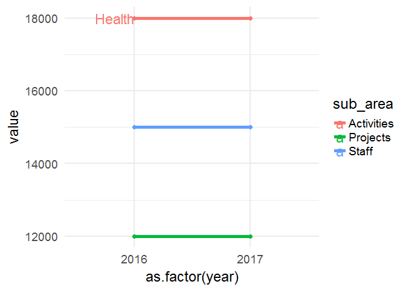
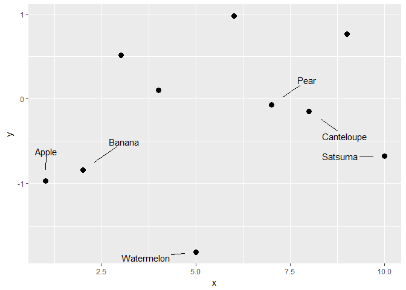

# Sweet R tricks

Tips and tricks in R & RStudio. Gathered from wherever I see them.
Mainly a repo for me to remember cool little R tips I’ve seen around the
place. I hope to update it regularly – feel free to fork, add your own,
and send a PR.

# I/O

### Making Saved Data Smaller

Adding `compress = "xz"` to your `save()` function can make things much
smaller. *Very* useful tip from [Ilya
Kasnitsky](https://ikashnitsky.github.io/):

``` r
library(congressbr)
data('senate_nominal_votes')
head(senate_nominal_votes)
#> # A tibble: 6 x 9
#>   vote_date           bill_id bill    legislature senator_id senator_name 
#>   <dttm>              <chr>   <chr>   <chr>       <chr>      <chr>        
#> 1 1991-06-06 00:00:00 19615   PLC:19~ 49          31         Guilherme Pa~
#> 2 1991-06-06 00:00:00 19615   PLC:19~ 49          47         Jose Sarney  
#> 3 1991-06-06 00:00:00 19615   PLC:19~ 49          82         Amazonino Me~
#> 4 1991-06-06 00:00:00 19615   PLC:19~ 49          33         Humberto Luc~
#> 5 1991-06-06 00:00:00 19615   PLC:19~ 49          79         Valmir Campe~
#> 6 1991-06-06 00:00:00 19615   PLC:19~ 49          84         Antonio Mariz
#> # ... with 3 more variables: senator_vote <chr>, senator_party <chr>,
#> #   senator_state <chr>
save(list = ls(), file = "sen.Rda")
save(list = ls(), file = "sen2.Rda", compress = "xz")

file.info("sen.Rda")$size
#> [1] 73485
file.info("sen2.Rda")$size
#> [1] 38408
```

[Source](https://twitter.com/ikashnitsky/status/973325892956184576)

## Tables

### Totals columns

Nice totals column, from Andrew Heiss:

[source](https://twitter.com/andrewheiss/status/973325552596664321?s=03)

``` r
library(dplyr)
#> 
#> Attaching package: 'dplyr'
#> The following objects are masked from 'package:stats':
#> 
#>     filter, lag
#> The following objects are masked from 'package:base':
#> 
#>     intersect, setdiff, setequal, union
library(stringr)
library(pander)
mtcars %>% 
  mutate(cars = row.names(.),
         cars = str_extract(cars, "[A-Za-z\\b]*")) %>% 
  count(cars, am) %>% 
  bind_rows(summarise_at(., vars(n), funs(sum)) %>%
              mutate(cars = "**Total**")
  ) %>% 
  pandoc.table()
#> 
#> ---------------------
#>    cars      am   n  
#> ----------- ---- ----
#>     AMC      0    1  
#> 
#>  Cadillac    0    1  
#> 
#>   Camaro     0    1  
#> 
#>  Chrysler    0    1  
#> 
#>   Datsun     1    1  
#> 
#>    Dodge     0    1  
#> 
#>   Duster     0    1  
#> 
#>   Ferrari    1    1  
#> 
#>    Fiat      1    2  
#> 
#>    Ford      1    1  
#> 
#>    Honda     1    1  
#> 
#>   Hornet     0    2  
#> 
#>   Lincoln    0    1  
#> 
#>    Lotus     1    1  
#> 
#>  Maserati    1    1  
#> 
#>    Mazda     1    2  
#> 
#>    Merc      0    7  
#> 
#>   Pontiac    0    1  
#> 
#>   Porsche    1    1  
#> 
#>   Toyota     0    1  
#> 
#>   Toyota     1    1  
#> 
#>   Valiant    0    1  
#> 
#>    Volvo     1    1  
#> 
#>  **Total**   NA   32 
#> ---------------------
```

Also, from the comments to the above tweet, by Sam Firke, the author the
[janitor](https://github.com/sfirke/janitor) package (I prefer this
actually):

``` r
library(dplyr)
library(janitor)
mtcars %>% 
  mutate(cars = row.names(.),
         cars = str_extract(cars, "[A-Za-z\\b]*")) %>% 
  count(cars, am) %>% 
  adorn_totals()
#> # A tibble: 24 x 4
#>    cars        am     n Total
#>    <chr>    <dbl> <int> <dbl>
#>  1 AMC         0.     1    1.
#>  2 Cadillac    0.     1    1.
#>  3 Camaro      0.     1    1.
#>  4 Chrysler    0.     1    1.
#>  5 Datsun      1.     1    2.
#>  6 Dodge       0.     1    1.
#>  7 Duster      0.     1    1.
#>  8 Ferrari     1.     1    2.
#>  9 Fiat        1.     2    3.
#> 10 Ford        1.     1    2.
#> # ... with 14 more rows
```

# ggplot2

You can use curly braces (`{}`) to avail of data wrangling in the middle
of your ggplot2 code, as
[Alistair](https://stackoverflow.com/users/4497050/alistaire) once
explained to me. I can’t find the code I was working on at the time, but
the idea was to make some slopegraphs. This is a toy/ugly little
example:

``` r
library(dplyr); library(ggplot2)

df <- tibble(
  area = rep(c("Health", "Education"), 6),
  sub_area = rep(c("Staff", "Projects", "Activities"), 4),
  year = c(rep(2016, 6), rep(2017, 6)),
  value = c(15000, 12000, 18000, 24000, 14000, 12000, 13000, 16000, 11000, 
            8000, 15000, 19000)
) %>% arrange(area)

df %>% filter(area == "Health") %>% {
    ggplot(.) +    # add . to specify to insert results here
        geom_line(aes(x = as.factor(year), y = value, 
                      group = sub_area, color = sub_area), size = 2) + 
        geom_point(aes(x = as.factor(year), y = value, 
                       group = sub_area, color = sub_area), size = 2) +
        theme_minimal(base_size = 18) + 
        geom_text(data = dplyr::filter(., 
        year == 2016 & sub_area == "Activities"),    # and here
                  aes(x = as.factor(year), y = value, 
                      color = sub_area, label = sub_area), size = 6, 
                      hjust = 1.2) +
    xlab(NULL) + ylab(NULL) + theme(legend.position = "none")
}
```

<!-- -->
[Source](https://stackoverflow.com/questions/44007998/subset-filter-in-dplyr-chain-with-ggplot2)

Neat little trick from James Goldie – you can also use
`dplyr::case_when()` to highlight certain points on a plot:

``` r
library(ggplot2); library(ggrepel); library(dplyr)

df <- tibble(
  x = 1:10,
  y = rnorm(10),
  name = c("Apple", "Banana", "Kiwi", "Orange", "Watermelon",
           "Grapes", "Pear", "Canteloupe", "Tomato", "Satsuma")) %>%
  mutate(name_poor = case_when(
    y < 0 ~ name,
    TRUE ~ ""))

ggplot(df, aes(x = x, y = y)) +
  geom_point(size = 3) +
  geom_text_repel(aes(label = name_poor), point.padding = 2)
```

<!-- -->
[Source](https://twitter.com/rensa_co/status/976340414016843776?s=08)

## RStudio tricks

`ts` plus Shift and Tab gives you a nice data-stamped code section:

``` r
# Sun Mar 25 14:36:54 2018 ------------------------------
```

[Source](https://community.rstudio.com/t/rstudio-hidden-gems/4974)
