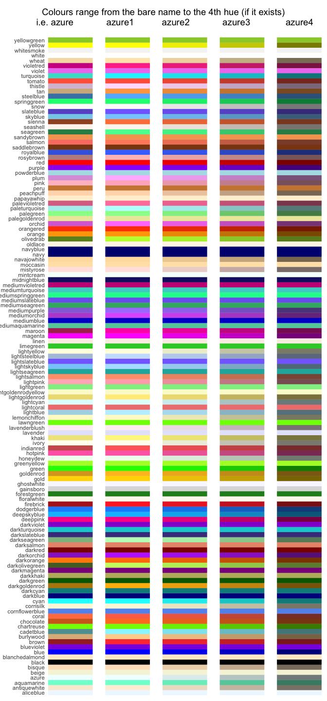
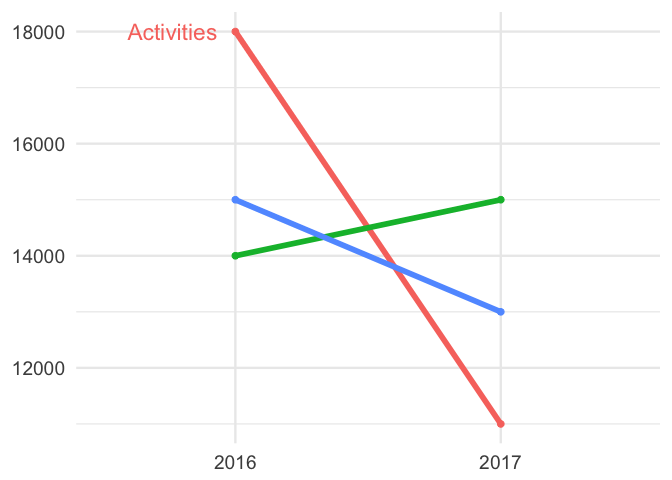
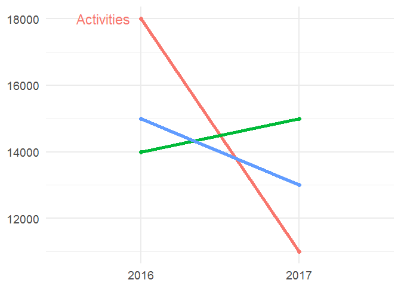
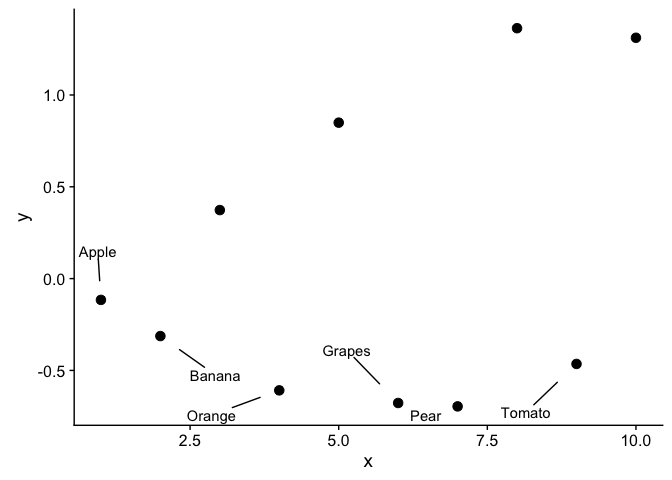

# Sweet R tricks :tophat::rabbit:

Tips and tricks in R & RStudio, gathered from wherever I see them.
Mainly a repo for me to remember cool little R tips I’ve seen around the
place :metal:. I hope to update it regularly – feel free to fork, add
your own, and send a PR. I’ve left the `library()` calls in every chunk,
in case you want to copy and paste some code. Long code chunks are
hidden for readability. Just click on the little arrow and you can see
the code. **This is clearly a work-in-progress-that-might-never-finish,
so any corrections/tips/pull requests/additions are very welcome\!**

# I/O :minidisc:

### Making Saved Data Smaller

Adding `compress = "xz"` to your `save()` function can make things much
smaller. *Very* useful tip from [Ilya
Kasnitsky](https://ikashnitsky.github.io/):

``` r
library(congressbr)
data('senate_nominal_votes')
head(senate_nominal_votes)
#> # A tibble: 6 x 9
#>   vote_date           bill_id bill    legislature senator_id senator_name 
#>   <dttm>              <chr>   <chr>   <chr>       <chr>      <chr>        
#> 1 1991-06-06 00:00:00 19615   PLC:19~ 49          31         Guilherme Pa~
#> 2 1991-06-06 00:00:00 19615   PLC:19~ 49          47         Jose Sarney  
#> 3 1991-06-06 00:00:00 19615   PLC:19~ 49          82         Amazonino Me~
#> 4 1991-06-06 00:00:00 19615   PLC:19~ 49          33         Humberto Luc~
#> 5 1991-06-06 00:00:00 19615   PLC:19~ 49          79         Valmir Campe~
#> 6 1991-06-06 00:00:00 19615   PLC:19~ 49          84         Antonio Mariz
#> # ... with 3 more variables: senator_vote <chr>, senator_party <chr>,
#> #   senator_state <chr>
save(list = ls(), file = "sen.Rda")
save(list = ls(), file = "sen2.Rda", compress = "xz")

file.info("sen.Rda")$size
#> [1] 73485
file.info("sen2.Rda")$size
#> [1] 38408
```

[Source](https://twitter.com/ikashnitsky/status/973325892956184576)

## Packages :package:

### Loading more than one at the same time

`library()` or `require()` only load one package at a time, but…

``` r

packages <- c("dplyr", "ggplot2", "rstan", "readr")

lapply(packages, library, character.only = TRUE)
```

This code loads as many packages as you put in `packages`. They need to
be installed first, of course\!

### Saving and re-installing old packages on a new version of R

There are a few ways to do this, but this works. You just need to put in
your version of R:  

<details>

<summary>Click to see code</summary>

``` r
version <- "3.3"  #just an example
old.packages <- list.files(paste0("/Library/Frameworks/R.framework/Versions/", version, "/Resources/library"))

# Install packages in the previous version. 

# For each package p in previous version...
    for (p in old.packages) {
      # ... Only if p is not already installed
      if (!(p %in% installed.packages()[,"Package"])) {
        # Install p 
        install.packages(p) 
      }
    }
```

</details>

## Tables :page\_with\_curl:

### Totals columns

Nice totals column, from Andrew Heiss:

[source](https://twitter.com/andrewheiss/status/973325552596664321?s=03)

<details>

<summary>Click to see code</summary>

``` r
library(dplyr)
library(stringr)
library(pander)
mtcars %>% 
  mutate(cars = row.names(.),
         cars = str_extract(cars, "[A-Za-z\\b]*")) %>% 
  count(cars, am) %>% 
  bind_rows(summarise_at(., vars(n), funs(sum)) %>%
              mutate(cars = "**Total**")
  ) %>% 
  pandoc.table()
#> 
#> ---------------------
#>    cars      am   n  
#> ----------- ---- ----
#>     AMC      0    1  
#> 
#>  Cadillac    0    1  
#> 
#>   Camaro     0    1  
#> 
#>  Chrysler    0    1  
#> 
#>   Datsun     1    1  
#> 
#>    Dodge     0    1  
#> 
#>   Duster     0    1  
#> 
#>   Ferrari    1    1  
#> 
#>    Fiat      1    2  
#> 
#>    Ford      1    1  
#> 
#>    Honda     1    1  
#> 
#>   Hornet     0    2  
#> 
#>   Lincoln    0    1  
#> 
#>    Lotus     1    1  
#> 
#>  Maserati    1    1  
#> 
#>    Mazda     1    2  
#> 
#>    Merc      0    7  
#> 
#>   Pontiac    0    1  
#> 
#>   Porsche    1    1  
#> 
#>   Toyota     0    1  
#> 
#>   Toyota     1    1  
#> 
#>   Valiant    0    1  
#> 
#>    Volvo     1    1  
#> 
#>  **Total**   NA   32 
#> ---------------------
```

Also, from the comments to the above tweet, by Sam Firke, the author the
[janitor](https://github.com/sfirke/janitor) package (I prefer this
actually):

``` r
library(dplyr)
library(janitor)
mtcars %>% 
  mutate(cars = row.names(.),
         cars = str_extract(cars, "[A-Za-z\\b]*")) %>% 
  count(cars, am) %>% 
  adorn_totals()
#>      cars am  n
#>       AMC  0  1
#>  Cadillac  0  1
#>    Camaro  0  1
#>  Chrysler  0  1
#>    Datsun  1  1
#>     Dodge  0  1
#>    Duster  0  1
#>   Ferrari  1  1
#>      Fiat  1  2
#>      Ford  1  1
#>     Honda  1  1
#>    Hornet  0  2
#>   Lincoln  0  1
#>     Lotus  1  1
#>  Maserati  1  1
#>     Mazda  1  2
#>      Merc  0  7
#>   Pontiac  0  1
#>   Porsche  1  1
#>    Toyota  0  1
#>    Toyota  1  1
#>   Valiant  0  1
#>     Volvo  1  1
#>     Total 11 32
```

</details>

## Graphics :chart\_with\_upwards\_trend:

### Colours :art:

Want to see all the colours available in R? Here’s a ggplot2 version of
[this great
gist](https://github.com/hdugan/rColorTable/blob/master/rColorTable.R):  

<details>

<summary>Click to see code</summary>

``` r
# R colors minus 100 shades of grey
library(dplyr)
library(stringr)
library(ggplot2)
library(tibble)
library(cowplot)

# get 'data':
colour <- tibble(colours = colors()) %>%
  filter(!grepl("gray", colours),
         !grepl("grey", colours)) %>%
  mutate(general_colour = gsub("[0-9]", "", colours),
         c1 = ifelse(grepl("1", colours), 1, 0),
         c2 = ifelse(grepl("2", colours), 1, 0),
         c3 = ifelse(grepl("3", colours), 1, 0),
         c4 = ifelse(grepl("4", colours), 1, 0)) %>%
  select(-1) %>%
  group_by(general_colour) %>%
  summarise_all(funs(sum)) %>%
  ungroup() %>%
  mutate(c1 = ifelse(grepl(1, c1), paste0(general_colour, c1), NA),
         c2 = ifelse(grepl(1, c2), paste0(general_colour, "2"), NA),
         c3 = ifelse(grepl(1, c3), paste0(general_colour, "3"), NA),
         c4 = ifelse(grepl(1, c4), paste0(general_colour, "4"), NA),
         c1 = ifelse(is.na(c1), general_colour, c1),
         c2 = ifelse(is.na(c2), general_colour, c2),
         c3 = ifelse(is.na(c3), general_colour, c3),
         c4 = ifelse(is.na(c4), general_colour, c4))


## create six plots:
# Just the names, by setting alpha to 0:
g0 <- ggplot(colour, aes(x = general_colour)) +
  geom_bar(position = "stack", alpha = 0) +
  coord_flip() +
  theme_minimal() +
  theme(legend.position = "none") +
  theme(axis.text.x = element_blank(), axis.ticks.x = element_blank(),
        axis.title.x = element_blank(), panel.grid = element_blank(),
        axis.title.y = element_blank())

g <- ggplot(colour, aes(x = general_colour, color = general_colour,
                   fill = general_colour)) +
  geom_bar(position = "stack") +
  coord_flip() +
  scale_color_manual(values = colour$general_colour) +
  scale_fill_manual(values = colour$general_colour) +
  theme_minimal() +
  theme(legend.position = "none") +
  theme(axis.text = element_blank(), axis.ticks = element_blank(),
        axis.title = element_blank(), panel.grid = element_blank())

g_1 <- ggplot(colour, aes(x = c1, color = c1,
                        fill = c1)) +
  geom_bar(position = "stack") +
  coord_flip() +
  scale_color_manual(values = colour$c1) +
  scale_fill_manual(values = colour$c1) +
  theme_minimal() +
  theme(legend.position = "none") +
  theme(axis.text = element_blank(), axis.ticks = element_blank(),
        axis.title = element_blank(), panel.grid = element_blank())

g_2 <- ggplot(colour, aes(x = c2, color = c2,
                        fill = c2)) +
  geom_bar(position = "stack") +
  coord_flip() +
  scale_color_manual(values = colour$c2) +
  scale_fill_manual(values = colour$c2) +
  theme_minimal() +
  theme(legend.position = "none") +
  theme(axis.text = element_blank(), axis.ticks = element_blank(),
        axis.title = element_blank(), panel.grid = element_blank())

g_3 <- ggplot(colour, aes(x = c3, color = c3,
                        fill = c3)) +
  geom_bar(position = "stack") +
  coord_flip() +
  scale_color_manual(values = colour$c3) +
  scale_fill_manual(values = colour$c3) +
  theme_minimal() +
  theme(legend.position = "none") +
  theme(axis.text = element_blank(), axis.ticks = element_blank(),
        axis.title = element_blank(), panel.grid = element_blank())

g_4 <- ggplot(colour, aes(x = c4, color = c4,
                        fill = c4)) +
  geom_bar(position = "stack") +
  coord_flip() +
  scale_color_manual(values = colour$c4) +
  scale_fill_manual(values = colour$c4) +
  theme_minimal() +
  theme(legend.position = "none") +
  theme(axis.text = element_blank(), axis.ticks = element_blank(),
        axis.title = element_blank(), panel.grid = element_blank())

# cowplot 'em all together:
p <- plot_grid(g0, g, g_1, g_2, g_3, g_4, align = "h", ncol = 6,
          rel_widths = c(.75, 1.05, 1.05, 1.05, 1.05, 1.05))
title <- ggdraw() + draw_label("Colours range from the bare name to the 4th hue (if it exists)\n           i.e. azure             azure1           azure2             azure3              azure4  ")
plot_grid(title, p, ncol = 1, rel_heights=c(0.05, 1))
```

<!-- -->

</details>

### ggplot2 :bar\_chart:

You can use curly braces (`{}`) to avail of data wrangling in the middle
of your ggplot2 code, as
[Alistair](https://stackoverflow.com/users/4497050/alistaire) once
explained to me. I can’t find the code I was working on at the time, but
the idea was to make some slopegraphs. This is a toy/ugly little
example:  

<details>

<summary>Click to see code</summary>

``` r
library(dplyr); library(ggplot2)

df <- tibble(
  area = rep(c("Health", "Education"), 6),
  sub_area = rep(c("Staff", "Projects", "Activities"), 4),
  year = c(rep(2016, 6), rep(2017, 6)),
  value = c(15000, 12000, 18000, 24000, 14000, 12000, 13000, 16000, 11000, 
            8000, 15000, 19000)
) %>% arrange(area)

df %>% filter(area == "Health") %>% {
    ggplot(.) +    # add . to specify to insert results here
        geom_line(aes(x = as.factor(year), y = value, 
                      group = sub_area, color = sub_area), size = 2) + 
        geom_point(aes(x = as.factor(year), y = value, 
                       group = sub_area, color = sub_area), size = 2) +
        theme_minimal(base_size = 18) + 
        geom_text(data = dplyr::filter(., 
        year == 2016 & sub_area == "Activities"),    # and here
                  aes(x = as.factor(year), y = value, 
                      color = sub_area, label = sub_area), size = 6, 
                      hjust = 1.2) +
    xlab(NULL) + ylab(NULL) + theme(legend.position = "none")
}
```

<!-- -->
[Source](https://stackoverflow.com/questions/44007998/subset-filter-in-dplyr-chain-with-ggplot2)

</details>

<br> Neat little trick from James Goldie – you can also use
`dplyr::case_when()` to highlight certain points on a plot:

<details>

<summary>Click to see code</summary>

``` r
library(ggplot2); library(ggrepel); library(dplyr)

df <- tibble(
  x = 1:10,
  y = rnorm(10),
  name = c("Apple", "Banana", "Kiwi", "Orange", "Watermelon",
           "Grapes", "Pear", "Canteloupe", "Tomato", "Satsuma")) %>%
  mutate(name_poor = case_when(
    y < 0 ~ name,
    TRUE ~ ""))

ggplot(df, aes(x = x, y = y)) +
  geom_point(size = 3) +
  geom_text_repel(aes(label = name_poor), point.padding = 2)
```

<!-- -->
[Source](https://twitter.com/rensa_co/status/976340414016843776?s=08)

</details>

## Speed :zap:

First off, an informative [SO
discussion](https://stackoverflow.com/questions/2908822/speed-up-the-loop-operation-in-r)
on the topic. Take-away: use specialized libraries (such as `data.table`
and `Rccp`) if you *really* need speed.

### For Loops

*Sometimes* `for()` loops may be necessary in R. They get a bad
reputation, but it’s not totally deserved (and the `apply()` family of
functions don’t necessarily speed things up, they’re just wrappers for
`for()` loops). This is old news in R, so let’s dig out an old [bookmark
of
mine](http://musicallyut.blogspot.com.br/2012/07/pre-allocate-your-vectors.html)
on the subject, by Utkarsh Upadhyay. (From 2012\!\! Wow. [Another
interesting
article](http://www.noamross.net/blog/2013/4/25/faster-talk.html) on the
subject, by Noam Ross, led me to it.)

<details>

<summary>Click to see code</summary>

``` r
library(dplyr)

f1 <- function (n) {
    l <- list()
    for(i in 1:n) {
        l <- append(l, i)
    }
    return(l)
}

f2 <- function (n) {
    l <- list()
    for(i in 1:n) {
        l[[length(l) + 1]] <- i
    }
    return(l)
}

f3 <- function (n) {
    l <- vector("list", n)  ## pre-allocate the size
    for(i in 1:n) {
        l[[i]] <- i
    }
    return(l)
}


warm.up <- function(f, n, times) {
    system.time(sapply(1:times, function (i) f(n)), gcFirst = T)
}

run.all <- function (reps = 10) {
    timesSeq <- seq(from = 10, to = 10000, by = 100)

    message("Running f1 ...")
    f1.prof <- sapply(timesSeq, function (arg) warm.up(f1, arg, reps)[1] / reps)

    message("Running f2 ...")
    f2.prof <- sapply(timesSeq, function (arg) warm.up(f2, arg, reps)[1] / reps)

    message("Running f3 ...")
    f3.prof <- sapply(timesSeq, function (arg) warm.up(f3, arg, reps)[1] / reps)

    return(tibble(
                timesSeq  =  timesSeq,
                f1.prof = f1.prof,
                f2.prof = f2.prof,
                f3.prof = f3.prof
    ))
}

x <- run.all()

library(ggplot2)
ggplot(x, aes(x = timesSeq, group = 1)) +
  geom_line(aes(y = f1.prof), colour = "#ec0b43") +
  geom_line(aes(y = f2.prof), colour = "#58355e") +
  geom_line(aes(y = f3.prof), colour = "#7ae7c7") +
  ylab(NULL) + theme_minimal() + xlab("Sequence") +
  annotate("label", x = 7500, y = 0.4, label = "f1.prof") 
```

<!-- -->

</details>

### Parentheses & Brackets

You might be surprised to find out that using extra brackets and
parentheses can slow your code down. To wit:

``` r
library(tictoc)

x <- 1:10

tic()
if(any(x > 5)) print("hey!")
#> [1] "hey!"
toc()
#> 0 sec elapsed

tic()
if(any(x > 5)) {
  print("hey!")
}
#> [1] "hey!"
toc()
#> 0.02 sec elapsed
```

I’ve seen this in a few places, but the most recent I remember was from
[Colin Fay](https://twitter.com/_ColinFay/status/946714488220389377) on
Twitter (Colin’s a fountain of little R tips, particularly for purrr).

## RMarkdown tricks :scroll:

### R \<–\> Python :snake:

Recently it’s been noticed by some [sharp]() observers that you can run
Python and R in the same RMarkdown document and that the objects from
one are available to the other.

<div id="did-it-work" class="section level2">

### JavaScript

If you use `results = 'asis'` in the head of your code chunk, i.e.
` ```{r results = 'asis'}`, RMarkdown will keep the result of the chunk
‘alive’, so to speak, in the document, for you to use. A good example
of this is with JavaScript, which you can use to make a nifty [d3]()
plot. A few bloggers have noted this, although I think the first was a
blogger named
[Alice](https://towardsdatascience.com/getting-r-and-d3-js-to-play-nicely-in-r-markdown-270e302a52d3).
Here I’ll use the example given by [Nick
Strayer](http://livefreeordichotomize.com/2017/01/24/custom-javascript-visualizations-in-rmarkdown/).
First we save our data to the JSON format:  

<details>

<summary>Click to see code</summary>

``` r
library(dplyr)
library(jsonlite)

send_df_to_js <- function(df){
  cat(
    paste(
    '<script>
      var data = ',toJSON(df),';
    </script>'
    , sep="")
  )
}

#Generate some random x and y data to plot
n <- 300
random_data <- data_frame(x = runif(n)*10) %>% 
  mutate(y = 0.5*x^3 - 1.3*x^2 + rnorm(n, mean = 0, sd = 80),
         group = paste("group", sample(c(1,2,3), n, replace = T)))

send_df_to_js(random_data)
```

<script>
      var data = [{"x":8.103,"y":86.7402,"group":"group 1"},{"x":8.7439,"y":197.4511,"group":"group 1"},{"x":4.2071,"y":29.451,"group":"group 2"},{"x":7.5617,"y":204.3649,"group":"group 1"},{"x":1.4189,"y":60.0383,"group":"group 1"},{"x":9.5949,"y":321.1256,"group":"group 3"},{"x":9.9908,"y":381.4802,"group":"group 1"},{"x":7.4749,"y":146.6041,"group":"group 2"},{"x":1.5231,"y":100.868,"group":"group 1"},{"x":8.3449,"y":388.6036,"group":"group 1"},{"x":1.207,"y":-30.9337,"group":"group 3"},{"x":0.7788,"y":42.0217,"group":"group 1"},{"x":4.5534,"y":-73.5783,"group":"group 1"},{"x":8.6564,"y":230.1357,"group":"group 1"},{"x":8.9658,"y":143.7412,"group":"group 2"},{"x":9.8511,"y":323.7692,"group":"group 1"},{"x":2.0767,"y":-34.4321,"group":"group 1"},{"x":7.2344,"y":65.7019,"group":"group 2"},{"x":9.7014,"y":292.3689,"group":"group 3"},{"x":0.1007,"y":-29.8162,"group":"group 2"},{"x":7.7548,"y":242.0706,"group":"group 1"},{"x":8.198,"y":63.9315,"group":"group 2"},{"x":7.0416,"y":4.8066,"group":"group 1"},{"x":9.2052,"y":254.2194,"group":"group 1"},{"x":1.7674,"y":28.545,"group":"group 3"},{"x":8.575,"y":375.1565,"group":"group 2"},{"x":7.0775,"y":168.8794,"group":"group 3"},{"x":3.7368,"y":-65.5175,"group":"group 1"},{"x":0.4063,"y":100.6763,"group":"group 3"},{"x":2.4053,"y":114.8471,"group":"group 1"},{"x":2.3741,"y":-92.57,"group":"group 1"},{"x":6.4647,"y":70.0536,"group":"group 3"},{"x":1.6201,"y":-81.2386,"group":"group 2"},{"x":2.075,"y":34.4821,"group":"group 3"},{"x":9.402,"y":450.3115,"group":"group 1"},{"x":0.4809,"y":-45.9321,"group":"group 3"},{"x":0.0238,"y":-108.7961,"group":"group 2"},{"x":8.4916,"y":218.1847,"group":"group 3"},{"x":9.8455,"y":421.8797,"group":"group 2"},{"x":3.7093,"y":-15.2337,"group":"group 3"},{"x":4.3968,"y":-101.6621,"group":"group 3"},{"x":5.1173,"y":89.087,"group":"group 1"},{"x":3.0655,"y":-15.3205,"group":"group 1"},{"x":8.1903,"y":145.7186,"group":"group 1"},{"x":6.8146,"y":-34.6354,"group":"group 3"},{"x":1.9743,"y":5.6999,"group":"group 3"},{"x":7.4757,"y":169.3731,"group":"group 1"},{"x":2.8917,"y":65.2363,"group":"group 3"},{"x":3.1654,"y":50.7972,"group":"group 3"},{"x":9.3466,"y":299.8652,"group":"group 1"},{"x":6.0921,"y":125.4469,"group":"group 3"},{"x":7.1024,"y":59.9396,"group":"group 2"},{"x":7.3469,"y":13.0229,"group":"group 3"},{"x":9.9294,"y":200.3085,"group":"group 3"},{"x":4.3294,"y":137.4486,"group":"group 3"},{"x":8.9375,"y":213.9669,"group":"group 3"},{"x":0.0383,"y":196.5973,"group":"group 1"},{"x":3.1562,"y":122.4486,"group":"group 3"},{"x":0.863,"y":49.265,"group":"group 2"},{"x":5.3438,"y":53.8001,"group":"group 1"},{"x":1.6782,"y":102.7396,"group":"group 2"},{"x":4.755,"y":33.6605,"group":"group 2"},{"x":0.3569,"y":54.5937,"group":"group 1"},{"x":3.2526,"y":-29.8945,"group":"group 2"},{"x":1.5654,"y":-128.9608,"group":"group 1"},{"x":6.9672,"y":98.1123,"group":"group 1"},{"x":6.502,"y":-8.0514,"group":"group 1"},{"x":7.0893,"y":126.5577,"group":"group 3"},{"x":2.6327,"y":44.2484,"group":"group 1"},{"x":1.0505,"y":36.6619,"group":"group 1"},{"x":9.9161,"y":271.8027,"group":"group 1"},{"x":2.2656,"y":16.1428,"group":"group 1"},{"x":4.4611,"y":38.3194,"group":"group 2"},{"x":1.9614,"y":-108.6956,"group":"group 1"},{"x":4.879,"y":-4.5173,"group":"group 2"},{"x":1.0558,"y":-77.1588,"group":"group 1"},{"x":7.6539,"y":155.9724,"group":"group 2"},{"x":9.6781,"y":335.5122,"group":"group 1"},{"x":9.5276,"y":287.7447,"group":"group 3"},{"x":5.5007,"y":-19.271,"group":"group 3"},{"x":6.3204,"y":148.122,"group":"group 2"},{"x":9.4689,"y":281.97,"group":"group 1"},{"x":5.9246,"y":47.7258,"group":"group 1"},{"x":7.6634,"y":147.9946,"group":"group 2"},{"x":9.5606,"y":370.3577,"group":"group 3"},{"x":8.5295,"y":284.1755,"group":"group 1"},{"x":3.4706,"y":-78.6518,"group":"group 3"},{"x":2.9121,"y":53.8723,"group":"group 3"},{"x":7.6155,"y":137.8683,"group":"group 2"},{"x":5.2936,"y":80.4765,"group":"group 1"},{"x":9.2398,"y":285.6219,"group":"group 2"},{"x":7.3712,"y":315.0608,"group":"group 1"},{"x":2.325,"y":-63.8048,"group":"group 3"},{"x":7.5872,"y":35.9008,"group":"group 2"},{"x":9.5515,"y":326,"group":"group 3"},{"x":5.9193,"y":97.0749,"group":"group 2"},{"x":1.4837,"y":65.496,"group":"group 1"},{"x":8.2412,"y":231.06,"group":"group 1"},{"x":9.6949,"y":489.9796,"group":"group 3"},{"x":8.9145,"y":270.6104,"group":"group 1"},{"x":1.2725,"y":-4.7867,"group":"group 2"},{"x":7.7914,"y":124.9516,"group":"group 3"},{"x":4.7834,"y":-17.6549,"group":"group 3"},{"x":2.7969,"y":36.6924,"group":"group 1"},{"x":2.9202,"y":-110.3515,"group":"group 3"},{"x":4.021,"y":78.6029,"group":"group 3"},{"x":5.726,"y":167.7728,"group":"group 2"},{"x":3.0021,"y":35.239,"group":"group 3"},{"x":5.9865,"y":52.8645,"group":"group 1"},{"x":1.5426,"y":-76.1036,"group":"group 1"},{"x":3.6409,"y":43.6313,"group":"group 1"},{"x":0.8369,"y":85.3464,"group":"group 1"},{"x":1.7144,"y":-68.4554,"group":"group 1"},{"x":1.6103,"y":-5.433,"group":"group 2"},{"x":3.4167,"y":100.5059,"group":"group 1"},{"x":7.4634,"y":50.1484,"group":"group 2"},{"x":0.2122,"y":-15.2685,"group":"group 3"},{"x":0.4485,"y":-44.1115,"group":"group 2"},{"x":1.6252,"y":70.0689,"group":"group 1"},{"x":1.5803,"y":-43.6638,"group":"group 1"},{"x":8.0066,"y":179.5825,"group":"group 1"},{"x":7.6754,"y":149.7667,"group":"group 2"},{"x":3.7629,"y":20.8573,"group":"group 3"},{"x":5.1304,"y":99.8339,"group":"group 2"},{"x":9.1251,"y":233.6965,"group":"group 1"},{"x":8.4244,"y":309.8546,"group":"group 2"},{"x":7.0516,"y":100.108,"group":"group 3"},{"x":7.5365,"y":121.0626,"group":"group 1"},{"x":0.6463,"y":95.7489,"group":"group 2"},{"x":8.0545,"y":101.5553,"group":"group 2"},{"x":3.5313,"y":-22.8517,"group":"group 2"},{"x":3.1859,"y":-49.1032,"group":"group 3"},{"x":2.4855,"y":-47.5173,"group":"group 1"},{"x":2.0365,"y":-95.5107,"group":"group 1"},{"x":0.4324,"y":-137.3014,"group":"group 2"},{"x":0.5931,"y":157.4185,"group":"group 1"},{"x":1.1845,"y":-102.37,"group":"group 1"},{"x":5.7486,"y":235.6096,"group":"group 3"},{"x":3.0686,"y":-132.6672,"group":"group 3"},{"x":5.9286,"y":20.8797,"group":"group 2"},{"x":5.1272,"y":-26.4321,"group":"group 2"},{"x":4.5057,"y":171.5009,"group":"group 1"},{"x":2.5383,"y":7.2243,"group":"group 2"},{"x":0.9511,"y":76.9624,"group":"group 3"},{"x":3.0795,"y":-61.3218,"group":"group 1"},{"x":3.703,"y":-87.7659,"group":"group 3"},{"x":2.1823,"y":-63.485,"group":"group 1"},{"x":8.6205,"y":170.364,"group":"group 2"},{"x":2.7893,"y":-17.7343,"group":"group 3"},{"x":4.3595,"y":79.9572,"group":"group 3"},{"x":7.617,"y":191.6001,"group":"group 1"},{"x":4.7626,"y":-29.8292,"group":"group 3"},{"x":2.5326,"y":153.7943,"group":"group 3"},{"x":0.539,"y":113.5021,"group":"group 3"},{"x":7.2031,"y":59.0557,"group":"group 3"},{"x":3.0999,"y":32.0745,"group":"group 1"},{"x":9.1232,"y":320.7872,"group":"group 2"},{"x":5.7735,"y":-59.6127,"group":"group 3"},{"x":0.6505,"y":-83.0923,"group":"group 3"},{"x":8.1185,"y":265.9682,"group":"group 2"},{"x":0.686,"y":52.7111,"group":"group 3"},{"x":3.3859,"y":18.3805,"group":"group 2"},{"x":0.4869,"y":-73.9643,"group":"group 3"},{"x":9.1598,"y":378.7131,"group":"group 3"},{"x":6.6697,"y":-18.0737,"group":"group 3"},{"x":6.4425,"y":87.9223,"group":"group 3"},{"x":2.6156,"y":-58.7537,"group":"group 1"},{"x":4.6022,"y":109.3342,"group":"group 3"},{"x":3.6885,"y":49.0313,"group":"group 3"},{"x":6.919,"y":30.8258,"group":"group 3"},{"x":4.0037,"y":170.8636,"group":"group 1"},{"x":4.4059,"y":22.9812,"group":"group 2"},{"x":8.7799,"y":200.8394,"group":"group 1"},{"x":7.6865,"y":262.7717,"group":"group 1"},{"x":0.4444,"y":25.0451,"group":"group 1"},{"x":1.3286,"y":-69.2757,"group":"group 3"},{"x":0.3063,"y":98.0064,"group":"group 1"},{"x":5.6595,"y":0.0823,"group":"group 2"},{"x":2.4996,"y":-11.543,"group":"group 3"},{"x":7.5537,"y":324.6813,"group":"group 3"},{"x":4.9615,"y":75.3146,"group":"group 1"},{"x":1.5169,"y":-39.5618,"group":"group 1"},{"x":7.6152,"y":242.282,"group":"group 1"},{"x":0.0961,"y":7.1361,"group":"group 1"},{"x":7.9532,"y":168.8155,"group":"group 1"},{"x":4.4579,"y":21.9089,"group":"group 2"},{"x":0.0177,"y":-39.6452,"group":"group 3"},{"x":1.6915,"y":-25.8754,"group":"group 3"},{"x":2.9173,"y":85.8438,"group":"group 3"},{"x":7.5948,"y":153.8223,"group":"group 3"},{"x":7.081,"y":81.9249,"group":"group 2"},{"x":6.2184,"y":97.795,"group":"group 3"},{"x":2.1373,"y":-4.313,"group":"group 2"},{"x":2.5535,"y":46.0033,"group":"group 3"},{"x":0.3039,"y":-27.0841,"group":"group 2"},{"x":2.1785,"y":19.4173,"group":"group 1"},{"x":1.34,"y":27.3163,"group":"group 2"},{"x":3.5686,"y":-28.19,"group":"group 2"},{"x":0.3973,"y":-16.8803,"group":"group 2"},{"x":0.5091,"y":43.2071,"group":"group 3"},{"x":4.2296,"y":65.2937,"group":"group 3"},{"x":4.951,"y":-57.5061,"group":"group 2"},{"x":8.3831,"y":300.9616,"group":"group 3"},{"x":3.2314,"y":-26.8956,"group":"group 1"},{"x":4.6488,"y":193.7889,"group":"group 2"},{"x":6.9427,"y":43.0276,"group":"group 3"},{"x":1.1255,"y":11.5909,"group":"group 2"},{"x":3.9973,"y":90.4737,"group":"group 2"},{"x":1.1128,"y":180.4831,"group":"group 3"},{"x":1.8209,"y":-64.5322,"group":"group 2"},{"x":1.9411,"y":98.1779,"group":"group 3"},{"x":6.6769,"y":100.5575,"group":"group 3"},{"x":7.5759,"y":184.8111,"group":"group 3"},{"x":8.7748,"y":280.273,"group":"group 2"},{"x":0.1171,"y":11.8293,"group":"group 1"},{"x":0.8159,"y":-145.6048,"group":"group 1"},{"x":6.6585,"y":236.956,"group":"group 1"},{"x":6.0998,"y":50.0843,"group":"group 1"},{"x":9.8368,"y":533.1323,"group":"group 3"},{"x":3.2973,"y":103.9156,"group":"group 3"},{"x":1.7268,"y":-155.304,"group":"group 1"},{"x":6.816,"y":47.5981,"group":"group 3"},{"x":6.6177,"y":106.5253,"group":"group 3"},{"x":7.9468,"y":50.4556,"group":"group 3"},{"x":1.5964,"y":74.7369,"group":"group 3"},{"x":9.6806,"y":310.5809,"group":"group 1"},{"x":2.7352,"y":-1.9341,"group":"group 2"},{"x":0.4426,"y":-109.1418,"group":"group 3"},{"x":4.386,"y":-38.042,"group":"group 3"},{"x":0.1925,"y":-24.4206,"group":"group 3"},{"x":6.588,"y":39.9157,"group":"group 3"},{"x":4.2437,"y":32.6954,"group":"group 3"},{"x":5.4985,"y":-30.503,"group":"group 1"},{"x":6.3582,"y":178.9358,"group":"group 2"},{"x":2.978,"y":-126.0909,"group":"group 2"},{"x":5.2623,"y":88.3583,"group":"group 3"},{"x":5.236,"y":38.6045,"group":"group 1"},{"x":3.3997,"y":83.6218,"group":"group 3"},{"x":3.4785,"y":-6.1039,"group":"group 3"},{"x":5.8229,"y":8.3752,"group":"group 3"},{"x":3.0161,"y":-60.3151,"group":"group 3"},{"x":1.4939,"y":-81.2438,"group":"group 2"},{"x":7.0634,"y":120.327,"group":"group 1"},{"x":5.7835,"y":91.3903,"group":"group 1"},{"x":7.1402,"y":220.1639,"group":"group 1"},{"x":2.9966,"y":-75.3986,"group":"group 1"},{"x":4.4911,"y":-94.7608,"group":"group 2"},{"x":4.4114,"y":74.951,"group":"group 3"},{"x":0.3112,"y":-39.9943,"group":"group 3"},{"x":3.8355,"y":78.8466,"group":"group 1"},{"x":7.1334,"y":124.8963,"group":"group 1"},{"x":9.5536,"y":251.8924,"group":"group 2"},{"x":8.9052,"y":191.0079,"group":"group 2"},{"x":5.4922,"y":-44.4077,"group":"group 2"},{"x":2.1255,"y":-12.3255,"group":"group 1"},{"x":1.3134,"y":-103.9604,"group":"group 2"},{"x":4.9493,"y":138.2637,"group":"group 1"},{"x":4.7896,"y":70.0343,"group":"group 2"},{"x":7.0502,"y":211.2358,"group":"group 1"},{"x":2.9233,"y":-67.497,"group":"group 2"},{"x":5.2475,"y":-74.4625,"group":"group 3"},{"x":3.3903,"y":-24.3826,"group":"group 3"},{"x":2.9965,"y":-24.6019,"group":"group 2"},{"x":0.88,"y":-78.8869,"group":"group 1"},{"x":8.6304,"y":226.2304,"group":"group 3"},{"x":4.5852,"y":30.2331,"group":"group 2"},{"x":5.2291,"y":-22.419,"group":"group 1"},{"x":9.9363,"y":452.5841,"group":"group 3"},{"x":2.5226,"y":-62.7196,"group":"group 3"},{"x":1.9795,"y":75.4291,"group":"group 3"},{"x":9.0446,"y":353.2988,"group":"group 3"},{"x":4.7386,"y":-85.0666,"group":"group 2"},{"x":2.6976,"y":52.0098,"group":"group 3"},{"x":7.5037,"y":111.3109,"group":"group 2"},{"x":9.1355,"y":370.7428,"group":"group 1"},{"x":8.6682,"y":134.4515,"group":"group 1"},{"x":7.1988,"y":89.4978,"group":"group 2"},{"x":8.4943,"y":212.2201,"group":"group 2"},{"x":9.3155,"y":202.7807,"group":"group 3"},{"x":1.8189,"y":115.0819,"group":"group 2"},{"x":8.62,"y":411.3743,"group":"group 2"},{"x":4.6895,"y":39.882,"group":"group 3"},{"x":9.5722,"y":369.8614,"group":"group 1"},{"x":0.4461,"y":-167.2508,"group":"group 2"},{"x":4.1167,"y":83.4281,"group":"group 2"},{"x":7.416,"y":17.7118,"group":"group 3"},{"x":2.7353,"y":-70.1984,"group":"group 1"},{"x":9.7059,"y":294.9552,"group":"group 3"},{"x":1.2325,"y":-35.8302,"group":"group 3"},{"x":6.1942,"y":10.8541,"group":"group 2"},{"x":0.5619,"y":-48.5107,"group":"group 1"},{"x":6.7181,"y":56.9658,"group":"group 1"},{"x":1.3658,"y":-128.5389,"group":"group 1"},{"x":4.1637,"y":-23.2093,"group":"group 1"},{"x":3.8346,"y":-12.2316,"group":"group 2"},{"x":1.7371,"y":69.0871,"group":"group 2"},{"x":4.1658,"y":-32.7748,"group":"group 2"},{"x":9.2749,"y":207.8547,"group":"group 1"},{"x":9.1014,"y":253.5837,"group":"group 1"},{"x":9.2798,"y":152.2201,"group":"group 1"}];
    </script>

So far, so good – the data is in our browser. In theory, now we can
include a `js` code block. It’s worth mentioning that, for me at least,
this doesn’t work perfectly (I’m probably doing something wrong). I had
to actually include this code in the html of this README (hence the
doubling of the code).

``` js
var point_vals = d3.select("#viz")
  .append("p")
  .attr("align", "center")
  .text("Mouseover some data!");

//Get how wide our page is in pixels so we can draw our plot in it
var page_width = $("#javascript").width();
console.log(page_width)
// set the dimensions and margins of the graph
var margin = 30,
    width = page_width - 2*margin,
    height = page_width*0.8 - 2*margin;
    
// Find max data values
var x_extent = d3.extent(data, d => d.x);
var y_extent = d3.extent(data, d => d.y);

// Set the scales 
var x = d3.scaleLinear()
  .domain(x_extent)
  .range([0, width]);
  
var y = d3.scaleLinear()
  .domain(y_extent)
  .range([height, 0]);

//Set up our SVG element
var svg = d3.select("#viz").append("svg")
    .attr("width", width + 2*margin)
    .attr("height", height + 2*margin)
  .append("g")
    .attr("transform",
          "translate(" + margin + "," + margin + ")");

var bounce_select = d3.transition()
    .duration(1000)
    .ease(d3.easeElastic.period(0.4));
    
// Add the scatterplot
svg.selectAll(".dots")
    .data(data)
  .enter().append("circle")
    .attr("class", "dots")
    .attr("fill", d => d.group === "group 1"? "steelblue":"orangered")
    .attr("fill-opacity", 0.3)
    .attr("r", 5)
    .attr("cx", d => x(d.x) )
    .attr("cy", d => y(d.y) )
    .on("mouseover", function(d){
       d3.selectAll(".dots").attr("r", 5) //make sure all the dots are small
       d3.select(this)
        .transition(bounce_select)
        .attr("r", 10);
      
       point_vals.text("X:" + d.x + " Y:" + d.y) //change the title of the graph to the datapoint
    });
    
// Draw the axes    
// Add the X Axis
svg.append("g")
    .attr("transform", "translate(0," + height + ")")
    .call(d3.axisBottom(x));

// Add the Y Axis
svg.append("g")
    .call(d3.axisLeft(y));
```

<script src="https://code.jquery.com/jquery-3.1.1.min.js"></script>

<script src="https://code.jquery.com/jquery-3.1.1.min.js"></script>

<script src="https://d3js.org/d3.v4.min.js"></script>

<div id="viz">

</div>

<pre class="js"><code>var point_vals = d3.select("#viz")
.append("p")
.attr("align", "center")
.text("Mouseover some data!");

//Get how wide our page is in pixels so we can draw our plot in it
var page_width = $("#javascript").width();

// set the dimensions and margins of the graph
var margin = 30,
width = page_width - 2*margin,
height = page_width*0.8 - 2*margin;

// Find max data values
var x_extent = d3.extent(data, d => d.x);
var y_extent = d3.extent(data, d => d.y);

// Set the scales 
var x = d3.scaleLinear()
.domain(x_extent)
.range([0, width]);

var y = d3.scaleLinear()
.domain(y_extent)
.range([height, 0]);

//Set up our SVG element
var svg = d3.select("#viz").append("svg")
.attr("width", width + 2*margin)
.attr("height", height + 2*margin)
.append("g")
.attr("transform",
      "translate(" + margin + "," + margin + ")");

var bounce_select = d3.transition()
.duration(1000)
.ease(d3.easeElastic.period(0.4));

// Add the scatterplot
svg.selectAll(".dots")
.data(data)
.enter().append("circle")
.attr("class", "dots")
.attr("fill", d => d.group === "group 1"? "steelblue":"orangered")
.attr("fill-opacity", 0.3)
.attr("r", 5)
.attr("cx", d => x(d.x) )
.attr("cy", d => y(d.y) )
.on("mouseover", function(d){
  d3.selectAll(".dots").attr("r", 5) //make sure all the dots are small
  d3.select(this)
  .transition(bounce_select)
  .attr("r", 10);
  
  point_vals.text("X:" + d.x + " Y:" + d.y) //change the title of the graph to the datapoint
});

// Draw the axes    
// Add the X Axis
svg.append("g")
.attr("transform", "translate(0," + height + ")")
.call(d3.axisBottom(x));

// Add the Y Axis
svg.append("g")
.call(d3.axisLeft(y));</code></pre>

<script type="text/javascript">
  var point_vals = d3.select("#viz")
.append("p")
.attr("align", "center")
.text("Mouseover some data!");

//Get how wide our page is in pixels so we can draw our plot in it
var page_width = $("#javascript").width();

// set the dimensions and margins of the graph
var margin = 30,
width = page_width - 2*margin,
height = page_width*0.8 - 2*margin;

// Find max data values
var x_extent = d3.extent(data, d => d.x);
var y_extent = d3.extent(data, d => d.y);

// Set the scales 
var x = d3.scaleLinear()
.domain(x_extent)
.range([0, width]);

var y = d3.scaleLinear()
.domain(y_extent)
.range([height, 0]);

//Set up our SVG element
var svg = d3.select("#viz").append("svg")
.attr("width", width + 2*margin)
.attr("height", height + 2*margin)
.append("g")
.attr("transform",
      "translate(" + margin + "," + margin + ")");

var bounce_select = d3.transition()
.duration(1000)
.ease(d3.easeElastic.period(0.4));

// Add the scatterplot
svg.selectAll(".dots")
.data(data)
.enter().append("circle")
.attr("class", "dots")
.attr("fill", d => d.group === "group 1"? "steelblue":"orangered")
.attr("fill-opacity", 0.3)
.attr("r", 5)
.attr("cx", d => x(d.x) )
.attr("cy", d => y(d.y) )
.on("mouseover", function(d){
  d3.selectAll(".dots").attr("r", 5) //make sure all the dots are small
  d3.select(this)
  .transition(bounce_select)
  .attr("r", 10);
  
  point_vals.text("X:" + d.x + " Y:" + d.y) //change the title of the graph to the datapoint
});

// Draw the axes    
// Add the X Axis
svg.append("g")
.attr("transform", "translate(0," + height + ")")
.call(d3.axisBottom(x));

// Add the Y Axis
svg.append("g")
.call(d3.axisLeft(y));
</script>

</div>

</details>

## RStudio tricks :computer:

`ts` plus Shift and Tab gives you a nice data-stamped code section:

``` r
# Sun Mar 25 14:36:54 2018 ------------------------------
```

[Source](https://community.rstudio.com/t/rstudio-hidden-gems/4974)
