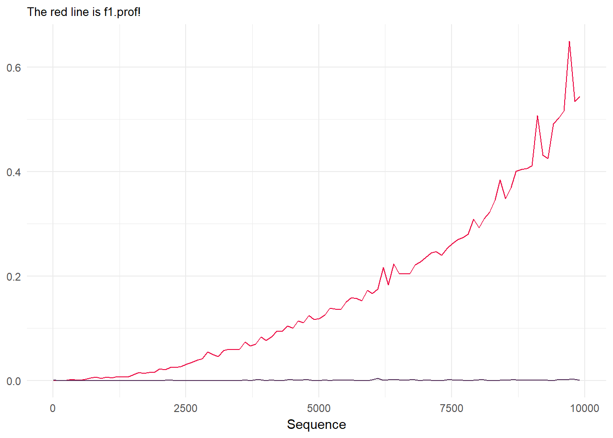

# Sweet R tricks :tophat::rabbit:

Tips and tricks in R & RStudio, gathered from wherever I see them.
Mainly a repo for me to remember cool little R tips I’ve seen around the
place :metal:. I hope to update it regularly – feel free to fork, add
your own, and send a PR. I’ve left the `library()` calls in every chunk,
in case you want to copy and paste some code. Long code chunks are
hidden for readability. Just click on the little arrow and you can see
the code. **This is clearly a work-in-progress-that-might-never-finish,
so any corrections/tips/pull requests/additions are very welcome\!**

# I/O :floppy\_disk:

### Making Saved Data Smaller

Adding `compress = "xz"` to your `save()` function can make things much
smaller. *Very* useful tip from [Ilya
Kasnitsky](https://ikashnitsky.github.io/):

``` r
library(congressbr)
data('senate_nominal_votes')
head(senate_nominal_votes)
#> # A tibble: 6 x 9
#>   vote_date           bill_id bill    legislature senator_id senator_name 
#>   <dttm>              <chr>   <chr>   <chr>       <chr>      <chr>        
#> 1 1991-06-06 00:00:00 19615   PLC:19… 49          31         Guilherme Pa…
#> 2 1991-06-06 00:00:00 19615   PLC:19… 49          47         Jose Sarney  
#> 3 1991-06-06 00:00:00 19615   PLC:19… 49          82         Amazonino Me…
#> 4 1991-06-06 00:00:00 19615   PLC:19… 49          33         Humberto Luc…
#> 5 1991-06-06 00:00:00 19615   PLC:19… 49          79         Valmir Campe…
#> 6 1991-06-06 00:00:00 19615   PLC:19… 49          84         Antonio Mariz
#> # ... with 3 more variables: senator_vote <chr>, senator_party <chr>,
#> #   senator_state <chr>
save(list = ls(), file = "sen.Rda")
save(list = ls(), file = "sen2.Rda", compress = "xz")

file.info("sen.Rda")$size
#> [1] 73485
file.info("sen2.Rda")$size
#> [1] 38416
```

[Source](https://twitter.com/ikashnitsky/status/973325892956184576)

### Reading in lots of files

It’s a common task that you have a folder full of files, let’s say
`.csv` files, and you want to read them all into R and put them in a
single data frame. Here’s a purrr version (you might want to use
data.table’s `fread()` and `rbind.list()` if you have lots of files):

``` r
library(readr)
library(dplyr)
library(purrr)
library(stringr)

df <- dir() %>%
  .[str_detect(., '.csv')] %>%
  map_df(read_csv)
```

That’s just beautiful code, isn’t it?

## Packages :package:

### Loading more than one at the same time

`library()` or `require()` only load one package at a time, but…

``` r

packages <- c("dplyr", "ggplot2", "rstan", "readr")

lapply(packages, library, character.only = TRUE)
```

This code loads as many packages as you put in `packages`. They need to
be installed first, of course\!

### Saving and re-installing old packages on a new version of R

There are a few ways to do this, but this works. You just need to put in
your version of R:  

<details>

<summary>Click to see code</summary>

``` r
version <- "3.3"  #just an example
old.packages <- list.files(paste0("/Library/Frameworks/R.framework/Versions/", version, "/Resources/library"))

# Install packages in the previous version. 

# For each package p in previous version...
    for (p in old.packages) {
      # ... Only if p is not already installed
      if (!(p %in% installed.packages()[,"Package"])) {
        # Install p 
        install.packages(p) 
      }
    }
```

I’m not sure this is necessary anymore, the last time I updated R, all
my packages were still installed. Anyway.

</details>

## Tables :page\_with\_curl:

### Totals columns

Nice totals column, from Andrew Heiss:

[source](https://twitter.com/andrewheiss/status/973325552596664321?s=03)

<details>

<summary>Click to see code</summary>

``` r
library(dplyr)
library(stringr)
library(pander)
mtcars %>% 
  mutate(cars = row.names(.),
         cars = str_extract(cars, "[A-Za-z\\b]*")) %>% 
  count(cars, am) %>% 
  bind_rows(summarise_at(., vars(n), funs(sum)) %>%
              mutate(cars = "**Total**")
  ) %>% 
  pandoc.table()
#> 
#> ---------------------
#>    cars      am   n  
#> ----------- ---- ----
#>     AMC      0    1  
#> 
#>  Cadillac    0    1  
#> 
#>   Camaro     0    1  
#> 
#>  Chrysler    0    1  
#> 
#>   Datsun     1    1  
#> 
#>    Dodge     0    1  
#> 
#>   Duster     0    1  
#> 
#>   Ferrari    1    1  
#> 
#>    Fiat      1    2  
#> 
#>    Ford      1    1  
#> 
#>    Honda     1    1  
#> 
#>   Hornet     0    2  
#> 
#>   Lincoln    0    1  
#> 
#>    Lotus     1    1  
#> 
#>  Maserati    1    1  
#> 
#>    Mazda     1    2  
#> 
#>    Merc      0    7  
#> 
#>   Pontiac    0    1  
#> 
#>   Porsche    1    1  
#> 
#>   Toyota     0    1  
#> 
#>   Toyota     1    1  
#> 
#>   Valiant    0    1  
#> 
#>    Volvo     1    1  
#> 
#>  **Total**   NA   32 
#> ---------------------
```

Also, from the comments to the above tweet, by Sam Firke, the author the
[janitor](https://github.com/sfirke/janitor) package (I prefer this
actually):

``` r
library(dplyr)
library(janitor)
mtcars %>% 
  mutate(cars = row.names(.),
         cars = str_extract(cars, "[A-Za-z\\b]*")) %>% 
  count(cars, am) %>% 
  adorn_totals()
#>      cars am  n
#>       AMC  0  1
#>  Cadillac  0  1
#>    Camaro  0  1
#>  Chrysler  0  1
#>    Datsun  1  1
#>     Dodge  0  1
#>    Duster  0  1
#>   Ferrari  1  1
#>      Fiat  1  2
#>      Ford  1  1
#>     Honda  1  1
#>    Hornet  0  2
#>   Lincoln  0  1
#>     Lotus  1  1
#>  Maserati  1  1
#>     Mazda  1  2
#>      Merc  0  7
#>   Pontiac  0  1
#>   Porsche  1  1
#>    Toyota  0  1
#>    Toyota  1  1
#>   Valiant  0  1
#>     Volvo  1  1
#>     Total 11 32
```

</details>

## Graphics :chart\_with\_upwards\_trend:

### Colours :art:

Want to see all the colours available in R? Here’s a ggplot2 version of
[this great
gist](https://github.com/hdugan/rColorTable/blob/master/rColorTable.R):  

<details>

<summary>Click to see code</summary>

``` r
# R colors minus 100 shades of grey
library(dplyr)
library(stringr)
library(ggplot2)
library(tibble)
library(cowplot)

# get 'data':
colour <- tibble(colours = colors()) %>%
  filter(!grepl("gray", colours),
         !grepl("grey", colours)) %>%
  mutate(general_colour = gsub("[0-9]", "", colours),
         c1 = ifelse(grepl("1", colours), 1, 0),
         c2 = ifelse(grepl("2", colours), 1, 0),
         c3 = ifelse(grepl("3", colours), 1, 0),
         c4 = ifelse(grepl("4", colours), 1, 0)) %>%
  select(-1) %>%
  group_by(general_colour) %>%
  summarise_all(funs(sum)) %>%
  ungroup() %>%
  mutate(c1 = ifelse(grepl(1, c1), paste0(general_colour, c1), NA),
         c2 = ifelse(grepl(1, c2), paste0(general_colour, "2"), NA),
         c3 = ifelse(grepl(1, c3), paste0(general_colour, "3"), NA),
         c4 = ifelse(grepl(1, c4), paste0(general_colour, "4"), NA),
         c1 = ifelse(is.na(c1), general_colour, c1),
         c2 = ifelse(is.na(c2), general_colour, c2),
         c3 = ifelse(is.na(c3), general_colour, c3),
         c4 = ifelse(is.na(c4), general_colour, c4))


## create six plots:
# Just the names, by setting alpha to 0:
g0 <- ggplot(colour, aes(x = general_colour)) +
  geom_bar(position = "stack", alpha = 0) +
  coord_flip() +
  theme_minimal() +
  theme(legend.position = "none") +
  theme(axis.text.x = element_blank(), axis.ticks.x = element_blank(),
        axis.title.x = element_blank(), panel.grid = element_blank(),
        axis.title.y = element_blank())

g <- ggplot(colour, aes(x = general_colour, color = general_colour,
                   fill = general_colour)) +
  geom_bar(position = "stack") +
  coord_flip() +
  scale_color_manual(values = colour$general_colour) +
  scale_fill_manual(values = colour$general_colour) +
  theme_minimal() +
  theme(legend.position = "none") +
  theme(axis.text = element_blank(), axis.ticks = element_blank(),
        axis.title = element_blank(), panel.grid = element_blank())

g_1 <- ggplot(colour, aes(x = c1, color = c1,
                        fill = c1)) +
  geom_bar(position = "stack") +
  coord_flip() +
  scale_color_manual(values = colour$c1) +
  scale_fill_manual(values = colour$c1) +
  theme_minimal() +
  theme(legend.position = "none") +
  theme(axis.text = element_blank(), axis.ticks = element_blank(),
        axis.title = element_blank(), panel.grid = element_blank())

g_2 <- ggplot(colour, aes(x = c2, color = c2,
                        fill = c2)) +
  geom_bar(position = "stack") +
  coord_flip() +
  scale_color_manual(values = colour$c2) +
  scale_fill_manual(values = colour$c2) +
  theme_minimal() +
  theme(legend.position = "none") +
  theme(axis.text = element_blank(), axis.ticks = element_blank(),
        axis.title = element_blank(), panel.grid = element_blank())

g_3 <- ggplot(colour, aes(x = c3, color = c3,
                        fill = c3)) +
  geom_bar(position = "stack") +
  coord_flip() +
  scale_color_manual(values = colour$c3) +
  scale_fill_manual(values = colour$c3) +
  theme_minimal() +
  theme(legend.position = "none") +
  theme(axis.text = element_blank(), axis.ticks = element_blank(),
        axis.title = element_blank(), panel.grid = element_blank())

g_4 <- ggplot(colour, aes(x = c4, color = c4,
                        fill = c4)) +
  geom_bar(position = "stack") +
  coord_flip() +
  scale_color_manual(values = colour$c4) +
  scale_fill_manual(values = colour$c4) +
  theme_minimal() +
  theme(legend.position = "none") +
  theme(axis.text = element_blank(), axis.ticks = element_blank(),
        axis.title = element_blank(), panel.grid = element_blank())

# cowplot 'em all together:
p <- plot_grid(g0, g, g_1, g_2, g_3, g_4, align = "h", ncol = 6,
          rel_widths = c(.75, 1.05, 1.05, 1.05, 1.05, 1.05))
title <- ggdraw() + draw_label("Colours range from the bare name to the 4th hue (if it exists)\n           i.e. azure             azure1           azure2             azure3              azure4  ")
plot_grid(title, p, ncol = 1, rel_heights=c(0.05, 1))
```

<!-- -->

</details>

### ggplot2 :bar\_chart:

You can use curly braces (`{}`) to avail of data wrangling in the middle
of your ggplot2 code, as
[Alistair](https://stackoverflow.com/users/4497050/alistaire) once
explained to me. I can’t find the code I was working on at the time, but
the idea was to make some slopegraphs. This is a toy/ugly little
example:  

<details>

<summary>Click to see code</summary>

``` r
library(dplyr); library(ggplot2)

df <- tibble(
  area = rep(c("Health", "Education"), 6),
  sub_area = rep(c("Staff", "Projects", "Activities"), 4),
  year = c(rep(2016, 6), rep(2017, 6)),
  value = c(15000, 12000, 18000, 24000, 14000, 12000, 13000, 16000, 11000, 
            8000, 15000, 19000)
) %>% arrange(area)

df %>% filter(area == "Health") %>% {
    ggplot(.) +    # add . to specify to insert results here
        geom_line(aes(x = as.factor(year), y = value, 
                      group = sub_area, color = sub_area), size = 2) + 
        geom_point(aes(x = as.factor(year), y = value, 
                       group = sub_area, color = sub_area), size = 2) +
        theme_minimal(base_size = 18) + 
        geom_text(data = dplyr::filter(., 
        year == 2016 & sub_area == "Activities"),    # and here
                  aes(x = as.factor(year), y = value, 
                      color = sub_area, label = sub_area), size = 6, 
                      hjust = 1.2) +
    xlab(NULL) + ylab(NULL) + theme(legend.position = "none")
}
```

<!-- -->
[Source](https://stackoverflow.com/questions/44007998/subset-filter-in-dplyr-chain-with-ggplot2)

</details>

<br> Neat little trick from James Goldie – you can also use
`dplyr::case_when()` to highlight certain points on a plot:

<details>

<summary>Click to see code</summary>

``` r
library(ggplot2); library(ggrepel); library(dplyr)

df <- tibble(
  x = 1:10,
  y = rnorm(10),
  name = c("Apple", "Banana", "Kiwi", "Orange", "Watermelon",
           "Grapes", "Pear", "Canteloupe", "Tomato", "Satsuma")) %>%
  mutate(name_poor = case_when(
    y < 0 ~ name,
    TRUE ~ ""))

ggplot(df, aes(x = x, y = y)) +
  geom_point(size = 3) +
  geom_text_repel(aes(label = name_poor), point.padding = 2)
```

<!-- -->
[Source](https://twitter.com/rensa_co/status/976340414016843776?s=08)

</details>

## Speed :zap:

First off, an informative [SO
discussion](https://stackoverflow.com/questions/2908822/speed-up-the-loop-operation-in-r)
on the topic. Take-away: use specialized libraries (such as `data.table`
and `Rccp`) if you *really* need speed.

### For Loops

*Sometimes* `for()` loops may be necessary in R. They get a bad
reputation, but it’s not totally deserved (and the `apply()` family of
functions don’t necessarily speed things up, they’re just wrappers for
`for()` loops). This is old news in R, so let’s dig out an old [bookmark
of
mine](http://musicallyut.blogspot.com.br/2012/07/pre-allocate-your-vectors.html)
on the subject, by Utkarsh Upadhyay. (From 2012\!\! Wow. [Another
interesting
article](http://www.noamross.net/blog/2013/4/25/faster-talk.html) on the
subject, by Noam Ross, led me to it.) What’s happening here? We’re
*pre-allocating* vectors of the size we need before we run our for
loops. Makes all the difference:

<details>

<summary>Click to see code</summary>

``` r
library(dplyr)

f1 <- function (n) {
    l <- list()
    for(i in 1:n) {
        l <- append(l, i)
    }
    return(l)
}

f2 <- function (n) {
    l <- vector("list", n)  ## pre-allocate the size
    for(i in 1:n) {
        l[[i]] <- i
    }
    return(l)
}


warm.up <- function(f, n, times) {
    system.time(sapply(1:times, function (i) f(n)), gcFirst = T)
}

run.all <- function (reps = 10) {
    timesSeq <- seq(from = 10, to = 10000, by = 100)

    message("Running f1 ...")
    f1.prof <- sapply(timesSeq, function (arg) warm.up(f1, arg, reps)[1] / reps)

    message("Running f2 ...")
    f2.prof <- sapply(timesSeq, function (arg) warm.up(f2, arg, reps)[1] / reps)

    return(tibble(
                timesSeq  =  timesSeq,
                f1.prof = f1.prof,
                f2.prof = f2.prof
    ))
}

x <- run.all()

library(ggplot2)
ggplot(x, aes(x = timesSeq, group = 1)) +
  geom_line(aes(y = f1.prof), colour = "#ec0b43") +
  geom_line(aes(y = f2.prof), colour = "#58355e") +
  ylab(NULL) + theme_minimal() + xlab("Sequence") +
  labs(subtitle = "The red line is f1.prof!")
```

<!-- -->

</details>

### Parentheses & Brackets

You might be surprised to find out that using extra brackets and
parentheses can slow your code down. To wit:

``` r
library(tictoc)

x <- 1:10

tic()
if(any(x > 5)) print("hey!")
#> [1] "hey!"
toc()
#> 0.002 sec elapsed

tic()
if(any(x > 5)) {
  print("hey!")
}
#> [1] "hey!"
toc()
#> 0.019 sec elapsed
```

I’ve seen this in a few places, but the most recent I remember was from
[Colin Fay](https://twitter.com/_ColinFay/status/946714488220389377) on
Twitter (Colin’s a fountain of little R tips, particularly for purrr).

## RMarkdown tricks :scroll:

You can save a lot of time by setting `cache = TRUE` in the knitr
options. I usually set `warning` and `message` to `FALSE` too, which
avoids package messages (like those from dplyr, for example) printing in
your RMarkdown document.

``` r
knitr::opts_chunk$set(
  cache = TRUE,
  message = FALSE, 
  warning = FALSE
)
```

### JavaScript

If you use `results = 'asis'` in the head of your code chunk, i.e.
` ```{r results = 'asis'}`, RMarkdown will keep the result of the chunk
‘alive’, so to speak, in the document, for you to use. A good example
of this is with JavaScript, which you can use to make a nifty
[d3](https://d3js.org/) plot. A few bloggers have noted this, although I
think the first was a blogger named
[Alice](https://towardsdatascience.com/getting-r-and-d3-js-to-play-nicely-in-r-markdown-270e302a52d3).
Here I’ll use the example given by [Nick
Strayer](http://livefreeordichotomize.com/2017/01/24/custom-javascript-visualizations-in-rmarkdown/).
First we save our data to the JSON format:  

<details>

<summary>Click to see code</summary>

``` r
library(dplyr)
library(jsonlite)

send_df_to_js <- function(df){
  cat(
    paste(
    '<script>
      var data = ',toJSON(df),';
    </script>'
    , sep="")
  )
}

#Generate some random x and y data to plot
n <- 300
random_data <- data_frame(x = runif(n)*10) %>% 
  mutate(y = 0.5*x^3 - 1.3*x^2 + rnorm(n, mean = 0, sd = 80),
         group = paste("group", sample(c(1,2,3), n, replace = T)))

send_df_to_js(random_data)
```

<script>
      var data = [{"x":5.3401,"y":39.0716,"group":"group 3"},{"x":6.6338,"y":93.7334,"group":"group 3"},{"x":8.2901,"y":228.0466,"group":"group 1"},{"x":2.7182,"y":37.5723,"group":"group 2"},{"x":1.5512,"y":-9.902,"group":"group 3"},{"x":1.042,"y":3.8274,"group":"group 2"},{"x":0.336,"y":1.4782,"group":"group 3"},{"x":2.8209,"y":-0.3232,"group":"group 1"},{"x":8.28,"y":255.8445,"group":"group 2"},{"x":4.2061,"y":63.6519,"group":"group 1"},{"x":6.7488,"y":202.0291,"group":"group 2"},{"x":4.3768,"y":-75.2349,"group":"group 3"},{"x":6.5177,"y":-6.1701,"group":"group 3"},{"x":0.4793,"y":-191.2183,"group":"group 3"},{"x":6.0034,"y":45.3629,"group":"group 1"},{"x":9.8132,"y":384.5149,"group":"group 3"},{"x":5.8042,"y":93.6758,"group":"group 2"},{"x":2.2953,"y":-3.3002,"group":"group 1"},{"x":3.5459,"y":-119.2527,"group":"group 2"},{"x":1.0486,"y":13.2127,"group":"group 1"},{"x":6.4506,"y":80.7153,"group":"group 2"},{"x":6.2397,"y":89.6931,"group":"group 2"},{"x":4.7163,"y":-47.4085,"group":"group 1"},{"x":0.5116,"y":-111.2345,"group":"group 1"},{"x":1.0823,"y":-18.8295,"group":"group 3"},{"x":3.4057,"y":79.3189,"group":"group 3"},{"x":0.2723,"y":98.7634,"group":"group 3"},{"x":9.9162,"y":433.4107,"group":"group 3"},{"x":6.7135,"y":125.9115,"group":"group 3"},{"x":1.9728,"y":86.3954,"group":"group 3"},{"x":2.8927,"y":-43.8808,"group":"group 2"},{"x":0.3748,"y":-13.5811,"group":"group 1"},{"x":7.379,"y":55.2453,"group":"group 2"},{"x":8.289,"y":122.4287,"group":"group 1"},{"x":3.4063,"y":109.6761,"group":"group 1"},{"x":4.8231,"y":-48.4254,"group":"group 1"},{"x":8.397,"y":248.0727,"group":"group 1"},{"x":0.1814,"y":86.3628,"group":"group 3"},{"x":1.2935,"y":7.3678,"group":"group 1"},{"x":2.1564,"y":-33.0926,"group":"group 1"},{"x":3.2591,"y":-18.7834,"group":"group 2"},{"x":2.7566,"y":-18.4932,"group":"group 1"},{"x":5.5267,"y":-14.8679,"group":"group 1"},{"x":8.3973,"y":364.6498,"group":"group 3"},{"x":9.1804,"y":311.1261,"group":"group 1"},{"x":2.8878,"y":18.5191,"group":"group 2"},{"x":4.871,"y":123.8731,"group":"group 3"},{"x":6.5283,"y":79.8275,"group":"group 1"},{"x":5.4959,"y":-53.2841,"group":"group 3"},{"x":9.7878,"y":281.9277,"group":"group 1"},{"x":7.2117,"y":91.9277,"group":"group 3"},{"x":7.3506,"y":46.0661,"group":"group 1"},{"x":9.7868,"y":323.0521,"group":"group 2"},{"x":0.7567,"y":-12.9832,"group":"group 1"},{"x":4.7054,"y":287.4406,"group":"group 1"},{"x":4.4307,"y":96.2093,"group":"group 2"},{"x":3.1056,"y":0.7669,"group":"group 1"},{"x":8.7168,"y":277.5708,"group":"group 2"},{"x":6.4043,"y":-33.9938,"group":"group 1"},{"x":0.7746,"y":-58.2481,"group":"group 1"},{"x":9.2001,"y":267.167,"group":"group 1"},{"x":1.7379,"y":-49.5483,"group":"group 1"},{"x":6.6733,"y":72.8959,"group":"group 1"},{"x":7.1162,"y":-6.1229,"group":"group 2"},{"x":3.9676,"y":55.3533,"group":"group 2"},{"x":7.4902,"y":125.5176,"group":"group 2"},{"x":9.7533,"y":298.3493,"group":"group 1"},{"x":5.1503,"y":-22.5537,"group":"group 2"},{"x":9.743,"y":310.087,"group":"group 1"},{"x":1.4588,"y":71.8041,"group":"group 1"},{"x":4.9573,"y":82.7077,"group":"group 1"},{"x":8.4968,"y":224.244,"group":"group 2"},{"x":6.6115,"y":252.2905,"group":"group 3"},{"x":1.595,"y":54.2913,"group":"group 2"},{"x":8.9802,"y":151.1671,"group":"group 2"},{"x":8.8759,"y":173.4016,"group":"group 1"},{"x":5.3035,"y":-23.5795,"group":"group 3"},{"x":2.0884,"y":30.44,"group":"group 3"},{"x":7.8842,"y":201.179,"group":"group 1"},{"x":0.8815,"y":-0.327,"group":"group 2"},{"x":6.4225,"y":165.6921,"group":"group 2"},{"x":7.4543,"y":143.5773,"group":"group 1"},{"x":8.4569,"y":268.552,"group":"group 1"},{"x":2.4357,"y":-67.6614,"group":"group 3"},{"x":4.4889,"y":268.9791,"group":"group 1"},{"x":2.02,"y":122.7683,"group":"group 2"},{"x":9.1044,"y":301.4335,"group":"group 1"},{"x":9.5319,"y":323.3781,"group":"group 3"},{"x":5.9219,"y":38.8553,"group":"group 1"},{"x":8.7043,"y":223.3024,"group":"group 2"},{"x":7.9521,"y":166.9715,"group":"group 1"},{"x":6.0137,"y":188.1122,"group":"group 1"},{"x":7.3462,"y":52.0581,"group":"group 3"},{"x":1.5033,"y":-10.8771,"group":"group 1"},{"x":2.6847,"y":75.6129,"group":"group 3"},{"x":1.2873,"y":-2.8788,"group":"group 2"},{"x":3.3253,"y":81.0933,"group":"group 1"},{"x":7.248,"y":132.5598,"group":"group 1"},{"x":8.1478,"y":27.8409,"group":"group 3"},{"x":6.9716,"y":-22.0497,"group":"group 3"},{"x":0.2425,"y":-79.9716,"group":"group 1"},{"x":3.213,"y":98.6473,"group":"group 1"},{"x":0.5308,"y":-85.5438,"group":"group 2"},{"x":5.3185,"y":1.5776,"group":"group 3"},{"x":9.0672,"y":304.428,"group":"group 3"},{"x":2.5451,"y":11.8706,"group":"group 3"},{"x":7.0998,"y":132.8174,"group":"group 3"},{"x":5.2286,"y":-14.7775,"group":"group 2"},{"x":0.0863,"y":-155.8024,"group":"group 3"},{"x":1.9475,"y":109.5262,"group":"group 1"},{"x":6.2054,"y":165.1241,"group":"group 1"},{"x":9.445,"y":360.9362,"group":"group 2"},{"x":3.5899,"y":-42.5037,"group":"group 3"},{"x":2.5347,"y":20.3554,"group":"group 2"},{"x":2.7302,"y":82.3466,"group":"group 2"},{"x":3.6318,"y":-10.6622,"group":"group 3"},{"x":6.3262,"y":87.7835,"group":"group 3"},{"x":7.7482,"y":21.1847,"group":"group 3"},{"x":6.711,"y":27.4605,"group":"group 2"},{"x":8.2919,"y":120.5505,"group":"group 1"},{"x":3.0582,"y":31.5244,"group":"group 2"},{"x":3.7789,"y":62.7967,"group":"group 1"},{"x":2.0883,"y":108.7493,"group":"group 3"},{"x":9.7546,"y":333.0125,"group":"group 3"},{"x":6.8388,"y":179.0434,"group":"group 1"},{"x":1.3324,"y":-135.0872,"group":"group 2"},{"x":3.3553,"y":134.0065,"group":"group 2"},{"x":1.5345,"y":119.3463,"group":"group 3"},{"x":4.8254,"y":44.2284,"group":"group 2"},{"x":9.8189,"y":309.5464,"group":"group 2"},{"x":4.7846,"y":49.7637,"group":"group 3"},{"x":1.4475,"y":-80.6493,"group":"group 1"},{"x":5.7272,"y":143.3858,"group":"group 1"},{"x":7.3321,"y":210.0113,"group":"group 1"},{"x":2.2124,"y":28.0535,"group":"group 2"},{"x":9.9749,"y":298.671,"group":"group 1"},{"x":5.0201,"y":-30.1775,"group":"group 2"},{"x":4.7448,"y":198.8992,"group":"group 3"},{"x":4.1104,"y":-76.0543,"group":"group 1"},{"x":1.2156,"y":-14.7394,"group":"group 3"},{"x":2.6877,"y":44.564,"group":"group 3"},{"x":7.2561,"y":167.5084,"group":"group 1"},{"x":8.7258,"y":205.4723,"group":"group 2"},{"x":6.2317,"y":6.5255,"group":"group 1"},{"x":1.7727,"y":-90.6107,"group":"group 3"},{"x":9.3149,"y":266.5969,"group":"group 1"},{"x":9.6344,"y":149.9815,"group":"group 2"},{"x":8.6082,"y":279.4059,"group":"group 1"},{"x":1.0726,"y":-52.6972,"group":"group 1"},{"x":9.843,"y":402.1405,"group":"group 3"},{"x":1.5852,"y":-37.1504,"group":"group 3"},{"x":9.5249,"y":311.9657,"group":"group 2"},{"x":8.9284,"y":140.0137,"group":"group 1"},{"x":3.5042,"y":-44.4756,"group":"group 1"},{"x":9.2041,"y":346.9741,"group":"group 1"},{"x":9.0163,"y":194.8099,"group":"group 3"},{"x":4.9707,"y":-11.5257,"group":"group 2"},{"x":7.5446,"y":236.0788,"group":"group 2"},{"x":0.8526,"y":-20.1829,"group":"group 1"},{"x":3.2751,"y":43.1731,"group":"group 3"},{"x":7.032,"y":135.1706,"group":"group 1"},{"x":3.2477,"y":149.7054,"group":"group 3"},{"x":0.2921,"y":-137.2948,"group":"group 1"},{"x":8.3942,"y":326.5445,"group":"group 1"},{"x":6.5685,"y":92.3232,"group":"group 3"},{"x":0.0315,"y":-87.4641,"group":"group 3"},{"x":8.1995,"y":252.0213,"group":"group 3"},{"x":2.9941,"y":-144.2693,"group":"group 3"},{"x":7.0606,"y":48.7119,"group":"group 1"},{"x":0.2902,"y":-13.4131,"group":"group 3"},{"x":4.1378,"y":66.0195,"group":"group 1"},{"x":0.1221,"y":-33.5307,"group":"group 3"},{"x":8.7297,"y":286.4539,"group":"group 2"},{"x":2.7856,"y":-12.4608,"group":"group 3"},{"x":4.3645,"y":64.2173,"group":"group 3"},{"x":0.2109,"y":74.0587,"group":"group 1"},{"x":8.2008,"y":211.5198,"group":"group 2"},{"x":0.6142,"y":95.6896,"group":"group 2"},{"x":9.6506,"y":331.0324,"group":"group 1"},{"x":0.2441,"y":-102.5501,"group":"group 3"},{"x":7.6222,"y":77.0404,"group":"group 2"},{"x":7.2438,"y":173.0458,"group":"group 2"},{"x":7.3664,"y":85.5676,"group":"group 3"},{"x":9.0511,"y":378.0037,"group":"group 2"},{"x":7.6071,"y":-38.5375,"group":"group 3"},{"x":1.4697,"y":-89.5441,"group":"group 3"},{"x":2.4283,"y":148.0333,"group":"group 3"},{"x":4.9121,"y":23.9139,"group":"group 3"},{"x":6.2296,"y":-2.2291,"group":"group 2"},{"x":1.689,"y":82.5961,"group":"group 1"},{"x":8.024,"y":40.7483,"group":"group 2"},{"x":3.112,"y":127.2583,"group":"group 1"},{"x":6.2983,"y":-23.4186,"group":"group 2"},{"x":7.0854,"y":193.5037,"group":"group 1"},{"x":0.415,"y":-89.7386,"group":"group 2"},{"x":2.5897,"y":19.8725,"group":"group 2"},{"x":0.4434,"y":-44.4674,"group":"group 1"},{"x":3.2005,"y":-78.5393,"group":"group 1"},{"x":9.0491,"y":178.9361,"group":"group 1"},{"x":3.4916,"y":-95.4597,"group":"group 3"},{"x":0.1626,"y":127.8352,"group":"group 3"},{"x":3.2353,"y":77.4257,"group":"group 3"},{"x":6.8344,"y":202.3569,"group":"group 2"},{"x":5.4742,"y":33.4236,"group":"group 2"},{"x":4.4144,"y":-167.1047,"group":"group 1"},{"x":5.6439,"y":106.7117,"group":"group 2"},{"x":1.9989,"y":57.9713,"group":"group 2"},{"x":3.265,"y":152.3362,"group":"group 1"},{"x":6.9887,"y":61.9043,"group":"group 3"},{"x":0.8996,"y":96.3712,"group":"group 3"},{"x":3.1876,"y":-82.2739,"group":"group 3"},{"x":0.3427,"y":52.6979,"group":"group 1"},{"x":4.6371,"y":48.6144,"group":"group 3"},{"x":6.7697,"y":214.3083,"group":"group 3"},{"x":2.9695,"y":-96.7446,"group":"group 2"},{"x":3.6816,"y":81.0893,"group":"group 2"},{"x":6.1486,"y":91.9551,"group":"group 2"},{"x":5.6726,"y":53.3356,"group":"group 2"},{"x":3.0237,"y":35.2014,"group":"group 2"},{"x":5.9755,"y":170.9988,"group":"group 3"},{"x":6.8583,"y":41.6304,"group":"group 1"},{"x":5.5321,"y":102.7111,"group":"group 1"},{"x":4.8113,"y":61.5925,"group":"group 2"},{"x":5.4571,"y":-108.6745,"group":"group 1"},{"x":2.4205,"y":-43.8031,"group":"group 3"},{"x":4.9326,"y":-42.7145,"group":"group 1"},{"x":9.0358,"y":245.1892,"group":"group 3"},{"x":5.0566,"y":5.7346,"group":"group 2"},{"x":1.0789,"y":8.0742,"group":"group 2"},{"x":7.8464,"y":100.0906,"group":"group 3"},{"x":0.6964,"y":-43.0469,"group":"group 1"},{"x":2.9975,"y":120.2605,"group":"group 1"},{"x":6.5908,"y":46.9502,"group":"group 1"},{"x":2.5817,"y":41.0879,"group":"group 3"},{"x":1.7494,"y":-29.5118,"group":"group 1"},{"x":5.8765,"y":168.0142,"group":"group 2"},{"x":5.2235,"y":79.5006,"group":"group 1"},{"x":6.6295,"y":-21.2934,"group":"group 2"},{"x":4.7348,"y":18.4201,"group":"group 3"},{"x":8.4796,"y":328.3131,"group":"group 3"},{"x":6.9292,"y":224.3846,"group":"group 2"},{"x":6.7626,"y":-22.6372,"group":"group 2"},{"x":9.2603,"y":252.4909,"group":"group 3"},{"x":7.1852,"y":113.0245,"group":"group 1"},{"x":1.6046,"y":32.3553,"group":"group 3"},{"x":8.9906,"y":201.6665,"group":"group 3"},{"x":4.8398,"y":177.6316,"group":"group 1"},{"x":8.7395,"y":269.9279,"group":"group 1"},{"x":6.3935,"y":44.1984,"group":"group 3"},{"x":5.1451,"y":-86.214,"group":"group 3"},{"x":3.9363,"y":35.3522,"group":"group 1"},{"x":7.9684,"y":149.4394,"group":"group 2"},{"x":8.3233,"y":286.2213,"group":"group 1"},{"x":6.414,"y":-9.5091,"group":"group 1"},{"x":5.4852,"y":-13.5517,"group":"group 2"},{"x":3.7499,"y":-4.6735,"group":"group 1"},{"x":0.2297,"y":-23.6311,"group":"group 3"},{"x":1.3884,"y":36.2688,"group":"group 3"},{"x":0.4032,"y":-75.3398,"group":"group 3"},{"x":7.9339,"y":36.7638,"group":"group 1"},{"x":2.6051,"y":71.6338,"group":"group 2"},{"x":4.9547,"y":49.1142,"group":"group 3"},{"x":0.8856,"y":79.6992,"group":"group 3"},{"x":0.7537,"y":22.5926,"group":"group 2"},{"x":1.1359,"y":-30.6749,"group":"group 3"},{"x":4.2417,"y":-54.5597,"group":"group 1"},{"x":7.9881,"y":302.9443,"group":"group 2"},{"x":2.7716,"y":146.4577,"group":"group 1"},{"x":9.6752,"y":247.8221,"group":"group 2"},{"x":7.3844,"y":233.3189,"group":"group 3"},{"x":7.4956,"y":-3.2397,"group":"group 3"},{"x":9.9709,"y":230.9283,"group":"group 2"},{"x":0.4639,"y":0.8442,"group":"group 1"},{"x":1.59,"y":66.4436,"group":"group 1"},{"x":9.9063,"y":236.6548,"group":"group 3"},{"x":3.9767,"y":27.414,"group":"group 1"},{"x":7.1504,"y":234.4303,"group":"group 1"},{"x":6.3607,"y":83.9958,"group":"group 3"},{"x":8.6672,"y":246.1361,"group":"group 3"},{"x":3.3607,"y":17.0356,"group":"group 2"},{"x":0.294,"y":110.404,"group":"group 1"},{"x":5.0893,"y":-38.2353,"group":"group 2"},{"x":5.1571,"y":110.0386,"group":"group 3"},{"x":2.0177,"y":-59.3852,"group":"group 1"},{"x":6.9289,"y":157.8074,"group":"group 1"},{"x":4.4457,"y":-15.0268,"group":"group 3"},{"x":5.0009,"y":65.3335,"group":"group 1"},{"x":9.3786,"y":258.7508,"group":"group 1"},{"x":1.002,"y":-149.8781,"group":"group 3"},{"x":8.4565,"y":373.7727,"group":"group 1"},{"x":2.0963,"y":96.0277,"group":"group 1"},{"x":1.7285,"y":-18.1061,"group":"group 2"},{"x":0.2727,"y":11.7664,"group":"group 2"},{"x":3.6222,"y":29.763,"group":"group 1"},{"x":8.0026,"y":119.3029,"group":"group 3"},{"x":8.3999,"y":210.0496,"group":"group 3"},{"x":4.0127,"y":-10.5231,"group":"group 2"},{"x":9.4984,"y":444.2657,"group":"group 3"},{"x":5.9862,"y":163.2665,"group":"group 1"},{"x":8.8508,"y":44.0191,"group":"group 2"}];
    </script>

So far, so good – the data is in our browser, as you can see from this
screenshot (or just open the inspector on this page):


In theory, now we can include a `js` code block. It’s worth mentioning
that, for me at least, this doesn’t work perfectly (I’m probably doing
something wrong). I had to actually include the Javascript code directly
into the html of this README, using `<script>` tags. Still,
making/parsing the data in R and then passing it on to d3 is pretty
sweet.

<script src="https://code.jquery.com/jquery-3.1.1.min.js"></script>

<script src="https://d3js.org/d3.v4.min.js"></script>

<div id="viz">

</div>

<script type="text/javascript">
  var point_vals = d3.select("#viz")
.append("p")
.attr("align", "center")
.text("Mouseover some data!");

//Get how wide our page is in pixels so we can draw our plot in it
var page_width = $("#javascript").width();

// set the dimensions and margins of the graph
var margin = 30,
width = page_width - 2*margin,
height = page_width*0.8 - 2*margin;

// Find max data values
var x_extent = d3.extent(data, d => d.x);
var y_extent = d3.extent(data, d => d.y);

// Set the scales 
var x = d3.scaleLinear()
.domain(x_extent)
.range([0, width]);

var y = d3.scaleLinear()
.domain(y_extent)
.range([height, 0]);

//Set up our SVG element
var svg = d3.select("#viz").append("svg")
.attr("width", width + 2*margin)
.attr("height", height + 2*margin)
.append("g")
.attr("transform",
      "translate(" + margin + "," + margin + ")");

var bounce_select = d3.transition()
.duration(1000)
.ease(d3.easeElastic.period(0.4));

// Add the scatterplot
svg.selectAll(".dots")
.data(data)
.enter().append("circle")
.attr("class", "dots")
.attr("fill", d => d.group === "group 1"? "steelblue":"orangered")
.attr("fill-opacity", 0.3)
.attr("r", 5)
.attr("cx", d => x(d.x) )
.attr("cy", d => y(d.y) )
.on("mouseover", function(d){
  d3.selectAll(".dots").attr("r", 5) //make sure all the dots are small
  d3.select(this)
  .transition(bounce_select)
  .attr("r", 10);
  
  point_vals.text("X:" + d.x + " Y:" + d.y) //change the title of the graph to the datapoint
});

// Draw the axes    
// Add the X Axis
svg.append("g")
.attr("transform", "translate(0," + height + ")")
.call(d3.axisBottom(x));

// Add the Y Axis
svg.append("g")
.call(d3.axisLeft(y));
</script>

</div>

Here’s the code that was used:

``` js
  var point_vals = d3.select("#viz")
.append("p")
.attr("align", "center")
.text("Mouseover some data!");

//Get how wide our page is in pixels so we can draw our plot in it
var page_width = $("#javascript").width();

// set the dimensions and margins of the graph
var margin = 30,
width = page_width - 2*margin,
height = page_width*0.8 - 2*margin;

// Find max data values
var x_extent = d3.extent(data, d => d.x);
var y_extent = d3.extent(data, d => d.y);

// Set the scales 
var x = d3.scaleLinear()
.domain(x_extent)
.range([0, width]);

var y = d3.scaleLinear()
.domain(y_extent)
.range([height, 0]);

//Set up our SVG element
var svg = d3.select("#viz").append("svg")
.attr("width", width + 2*margin)
.attr("height", height + 2*margin)
.append("g")
.attr("transform",
      "translate(" + margin + "," + margin + ")");

var bounce_select = d3.transition()
.duration(1000)
.ease(d3.easeElastic.period(0.4));

// Add the scatterplot
svg.selectAll(".dots")
.data(data)
.enter().append("circle")
.attr("class", "dots")
.attr("fill", d => d.group === "group 1"? "steelblue":"orangered")
.attr("fill-opacity", 0.3)
.attr("r", 5)
.attr("cx", d => x(d.x) )
.attr("cy", d => y(d.y) )
.on("mouseover", function(d){
  d3.selectAll(".dots").attr("r", 5) //make sure all the dots are small
  d3.select(this)
  .transition(bounce_select)
  .attr("r", 10);
  
  point_vals.text("X:" + d.x + " Y:" + d.y) //change the title of the graph to the datapoint
});

// Draw the axes    
// Add the X Axis
svg.append("g")
.attr("transform", "translate(0," + height + ")")
.call(d3.axisBottom(x));

// Add the Y Axis
svg.append("g")
.call(d3.axisLeft(y));
```

</details>

## Miscellaneous :pushpin:

### `%ni%`

I often find the syntax for negating `%in%` to be weird. For example:

<details>

<summary>Click to see code</summary>

``` r
library(dplyr)
library(tibble)
mtcars %>% 
  rownames_to_column(var = "cars") %>% 
  filter(!cars %in% c("Toyota Corolla", "Honda Civic", "Datsun 710"))
#>                   cars  mpg cyl  disp  hp drat    wt  qsec vs am gear carb
#> 1            Mazda RX4 21.0   6 160.0 110 3.90 2.620 16.46  0  1    4    4
#> 2        Mazda RX4 Wag 21.0   6 160.0 110 3.90 2.875 17.02  0  1    4    4
#> 3       Hornet 4 Drive 21.4   6 258.0 110 3.08 3.215 19.44  1  0    3    1
#> 4    Hornet Sportabout 18.7   8 360.0 175 3.15 3.440 17.02  0  0    3    2
#> 5              Valiant 18.1   6 225.0 105 2.76 3.460 20.22  1  0    3    1
#> 6           Duster 360 14.3   8 360.0 245 3.21 3.570 15.84  0  0    3    4
#> 7            Merc 240D 24.4   4 146.7  62 3.69 3.190 20.00  1  0    4    2
#> 8             Merc 230 22.8   4 140.8  95 3.92 3.150 22.90  1  0    4    2
#> 9             Merc 280 19.2   6 167.6 123 3.92 3.440 18.30  1  0    4    4
#> 10           Merc 280C 17.8   6 167.6 123 3.92 3.440 18.90  1  0    4    4
#> 11          Merc 450SE 16.4   8 275.8 180 3.07 4.070 17.40  0  0    3    3
#> 12          Merc 450SL 17.3   8 275.8 180 3.07 3.730 17.60  0  0    3    3
#> 13         Merc 450SLC 15.2   8 275.8 180 3.07 3.780 18.00  0  0    3    3
#> 14  Cadillac Fleetwood 10.4   8 472.0 205 2.93 5.250 17.98  0  0    3    4
#> 15 Lincoln Continental 10.4   8 460.0 215 3.00 5.424 17.82  0  0    3    4
#> 16   Chrysler Imperial 14.7   8 440.0 230 3.23 5.345 17.42  0  0    3    4
#> 17            Fiat 128 32.4   4  78.7  66 4.08 2.200 19.47  1  1    4    1
#> 18       Toyota Corona 21.5   4 120.1  97 3.70 2.465 20.01  1  0    3    1
#> 19    Dodge Challenger 15.5   8 318.0 150 2.76 3.520 16.87  0  0    3    2
#> 20         AMC Javelin 15.2   8 304.0 150 3.15 3.435 17.30  0  0    3    2
#> 21          Camaro Z28 13.3   8 350.0 245 3.73 3.840 15.41  0  0    3    4
#> 22    Pontiac Firebird 19.2   8 400.0 175 3.08 3.845 17.05  0  0    3    2
#> 23           Fiat X1-9 27.3   4  79.0  66 4.08 1.935 18.90  1  1    4    1
#> 24       Porsche 914-2 26.0   4 120.3  91 4.43 2.140 16.70  0  1    5    2
#> 25        Lotus Europa 30.4   4  95.1 113 3.77 1.513 16.90  1  1    5    2
#> 26      Ford Pantera L 15.8   8 351.0 264 4.22 3.170 14.50  0  1    5    4
#> 27        Ferrari Dino 19.7   6 145.0 175 3.62 2.770 15.50  0  1    5    6
#> 28       Maserati Bora 15.0   8 301.0 335 3.54 3.570 14.60  0  1    5    8
#> 29          Volvo 142E 21.4   4 121.0 109 4.11 2.780 18.60  1  1    4    2
```

‘Not-cars-in-list’ is defo weird for me. So I usually use `Negate()`:

``` r
library(dplyr)
library(tibble)
'%ni%' <- Negate('%in%')
mtcars %>% 
  rownames_to_column(var = "cars") %>% 
  filter(cars %ni% c("Toyota Corolla", "Honda Civic", "Datsun 710"))
#>                   cars  mpg cyl  disp  hp drat    wt  qsec vs am gear carb
#> 1            Mazda RX4 21.0   6 160.0 110 3.90 2.620 16.46  0  1    4    4
#> 2        Mazda RX4 Wag 21.0   6 160.0 110 3.90 2.875 17.02  0  1    4    4
#> 3       Hornet 4 Drive 21.4   6 258.0 110 3.08 3.215 19.44  1  0    3    1
#> 4    Hornet Sportabout 18.7   8 360.0 175 3.15 3.440 17.02  0  0    3    2
#> 5              Valiant 18.1   6 225.0 105 2.76 3.460 20.22  1  0    3    1
#> 6           Duster 360 14.3   8 360.0 245 3.21 3.570 15.84  0  0    3    4
#> 7            Merc 240D 24.4   4 146.7  62 3.69 3.190 20.00  1  0    4    2
#> 8             Merc 230 22.8   4 140.8  95 3.92 3.150 22.90  1  0    4    2
#> 9             Merc 280 19.2   6 167.6 123 3.92 3.440 18.30  1  0    4    4
#> 10           Merc 280C 17.8   6 167.6 123 3.92 3.440 18.90  1  0    4    4
#> 11          Merc 450SE 16.4   8 275.8 180 3.07 4.070 17.40  0  0    3    3
#> 12          Merc 450SL 17.3   8 275.8 180 3.07 3.730 17.60  0  0    3    3
#> 13         Merc 450SLC 15.2   8 275.8 180 3.07 3.780 18.00  0  0    3    3
#> 14  Cadillac Fleetwood 10.4   8 472.0 205 2.93 5.250 17.98  0  0    3    4
#> 15 Lincoln Continental 10.4   8 460.0 215 3.00 5.424 17.82  0  0    3    4
#> 16   Chrysler Imperial 14.7   8 440.0 230 3.23 5.345 17.42  0  0    3    4
#> 17            Fiat 128 32.4   4  78.7  66 4.08 2.200 19.47  1  1    4    1
#> 18       Toyota Corona 21.5   4 120.1  97 3.70 2.465 20.01  1  0    3    1
#> 19    Dodge Challenger 15.5   8 318.0 150 2.76 3.520 16.87  0  0    3    2
#> 20         AMC Javelin 15.2   8 304.0 150 3.15 3.435 17.30  0  0    3    2
#> 21          Camaro Z28 13.3   8 350.0 245 3.73 3.840 15.41  0  0    3    4
#> 22    Pontiac Firebird 19.2   8 400.0 175 3.08 3.845 17.05  0  0    3    2
#> 23           Fiat X1-9 27.3   4  79.0  66 4.08 1.935 18.90  1  1    4    1
#> 24       Porsche 914-2 26.0   4 120.3  91 4.43 2.140 16.70  0  1    5    2
#> 25        Lotus Europa 30.4   4  95.1 113 3.77 1.513 16.90  1  1    5    2
#> 26      Ford Pantera L 15.8   8 351.0 264 4.22 3.170 14.50  0  1    5    4
#> 27        Ferrari Dino 19.7   6 145.0 175 3.62 2.770 15.50  0  1    5    6
#> 28       Maserati Bora 15.0   8 301.0 335 3.54 3.570 14.60  0  1    5    8
#> 29          Volvo 142E 21.4   4 121.0 109 4.11 2.780 18.60  1  1    4    2
```

[Source](https://stackoverflow.com/questions/5831794/opposite-of-in)

</details>

### Getting daily builds of Rstudio

Often, the daily builds of RStudio have some interesting things
happening (although, of course, they might be a bit buggy). Using a
combination of scripts from [Bob
Rudis](https://bl.ocks.org/hrbrmstr/15375ec7a873d17ea5e2) and [Aron
Atkins](https://gist.github.com/aronatkins/ac3934e08d2961285bef), with a
few adjustments, we can download and install the latest build at a
certain time each day (I’ve stuck with Bob’s choice of 7:30 am). This is
for Mac OS only (Aron’s original script also allows for Ubuntu).  

<details>

<summary>Click to see code</summary>

First, create a preference list file (`.plist`) – I’ve called it
‘UpdateRstudio.plist’ (You can do this on Terminal in a mac with
`touch UpdateRstudio.plist`). The content of this is as follows:

    <?xml version="1.0" encoding="UTF-8"?>
    <!DOCTYPE plist PUBLIC "-//Apple//DTD PLIST 1.0//EN" "http://www.apple.com/DTDs/PropertyList-1.0.dtd">
    <plist version="1.0">
    <dict>
        <key>Label</key>
        <string>UpdateRStudio</string>
        <key>Program</key>
        <string>/usr/local/bin/rsupd</string>
        <key>StartCalendarInterval</key>
        <dict>
            <key>Hour</key>
            <integer>7</integer>
            <key>Minute</key>
            <integer>30</integer>
        </dict>
    </dict>
    </plist>

If you’d like to update at a different time, you can change the
`<key>Hour</key><integer>7</integer><key>Minute</key><integer>30</integer>`
part. This file goes in `/Library/LaunchAgents/`.  
Also, notice that the `.plist` is directed towards
`/usr/local/bin/rsupd` – that is the location of the next file we’re
going to make. It is:

``` bash
#!/bin/bash

set -e

install_macos_daily() {
    REDIRECT_URL="https://www.rstudio.org/download/latest/daily/desktop/mac/RStudio-latest.dmg"
    echo "Discovering daily build from: ${REDIRECT_URL}"

    # Perform a HEAD request to find the redirect target. We use the name of the
    # file to derive the mounted volume name.
    RELEASE_URL=$(curl -s -L -I -o /dev/null -w '%{url_effective}' "${REDIRECT_URL}")
    if [ "${RELEASE_URL}" ==  "" ]; then
        echo "Could not extract daily build URL from listing; maybe rstudio.org is having problems?"
        echo "Check: ${DAILY_LIST_URL}"
        exit 1
    fi

    echo "Downloading daily build from: ${RELEASE_URL}"

    cd /tmp

    TARGET=$(basename "${RELEASE_URL}")
    # Volume name mirrors the DMG filename without extension.
    # Simpler than parsing hdiutil output.
    VOLUME_NAME=$(basename "${TARGET}" .dmg)
    VOLUME_MOUNT="/Volumes/${VOLUME_NAME}"

    curl -L -o "${TARGET}" "${RELEASE_URL}"

    hdiutil attach -quiet "${TARGET}"

    # Remove any prior installation.
    rm -rf /Applications/RStudio.app
    cp -R "${VOLUME_MOUNT}/RStudio.app" /Applications

    hdiutil detach -quiet "${VOLUME_MOUNT}"

    rm "${TARGET}"

    echo "Installed ${VOLUME_NAME} to /Applications"
}

if [[ `uname -s` = "Darwin" ]]; then
    install_macos_daily
else
    echo "This script only works on OSX/macOS."
    exit 1
fi
```

As I said, this is saved as rsupd, into `/usr/local/bin`. We then make
it an executable with `chmod 755 /usr/local/bin/rsupd`. Then you load
the preference list with `launchctl load -w
/Library/LaunchAgents/UpdateRStudio.plist` (use `unload` here when you
want to stop it). Voilà, fresh RStudio for thee everyday.

</details>

## RStudio tricks :computer:

`ts` plus Shift and Tab gives you a nice data-stamped code section:

``` r
# Sun Mar 25 14:36:54 2018 ------------------------------
```

[Source](https://community.rstudio.com/t/rstudio-hidden-gems/4974)
